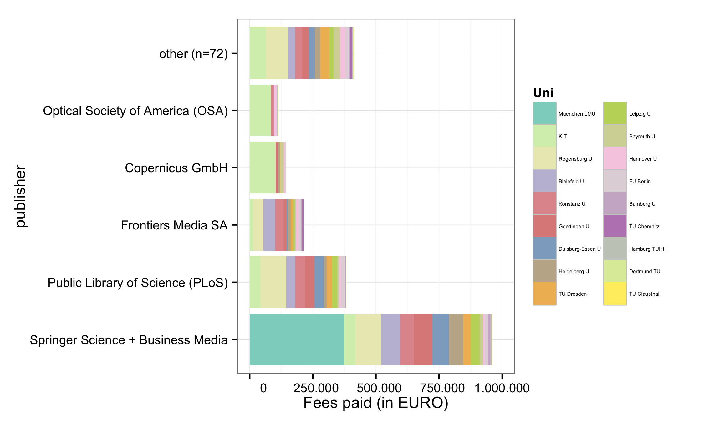
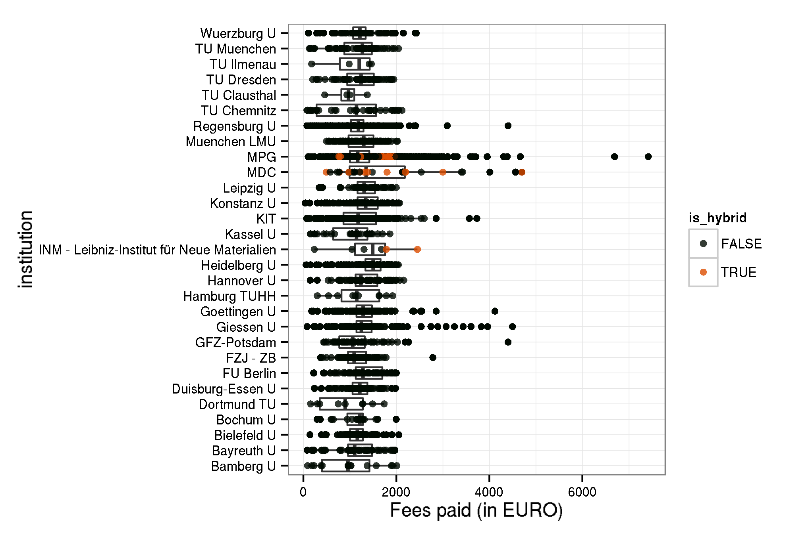
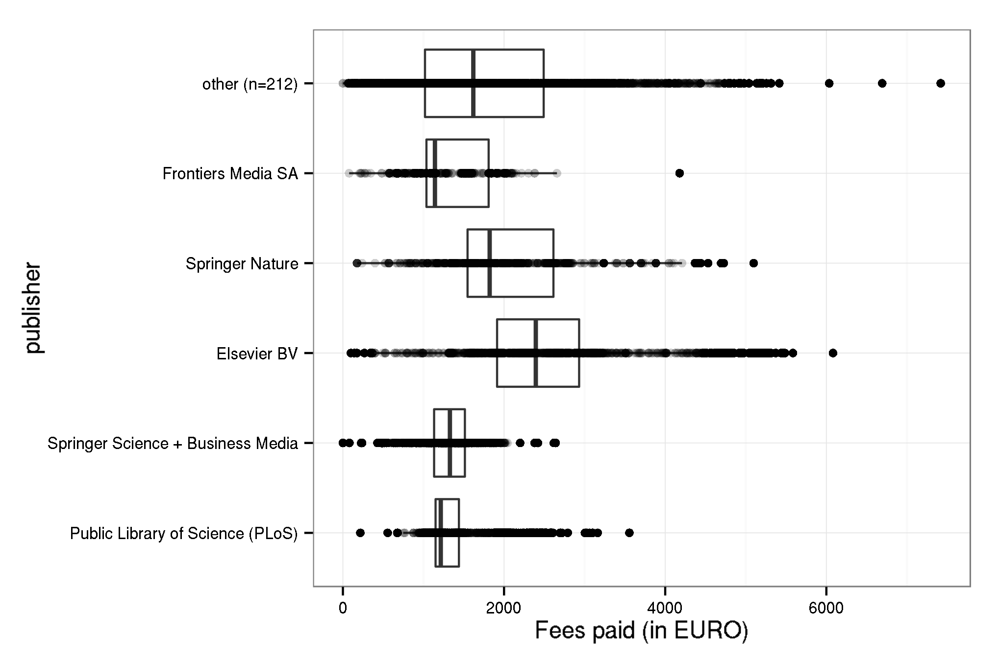
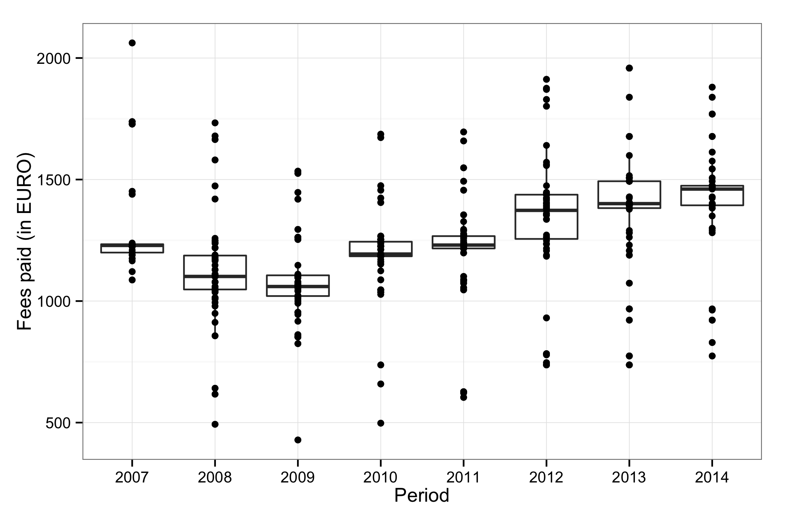

```{r, echo =FALSE}

knitr::opts_knit$set(base.url = "/")
knitr::opts_chunk$set(
  comment = "#>",
  collapse = TRUE,
  warning = FALSE, 
  message = FALSE,
  echo = FALSE,
  fig.width = 9,
  fig.height = 6
)
options(scipen = 0, digits = 2)
knitr::knit_hooks$set(inline = function(x) {
  prettyNum(x, big.mark=" ")
})
```

## About 

The aim of this repository is:

- to release datasets on fees paid for Open Access journal articles by German Universities under an Open Database License
- to share a copy of [Directory of Open Access Journals (DOAJ)](http://doaj.org/) journal master list (downloaded January 2014)
- to demonstrate how reporting on fee-based Open Access publishing can be made more transparent and reproducible across institutions.

## Participating Universities

So far, the following German universities have agreed to share information on paid author processing charges (APC):

- [Bayreuth University](http://www.ub.uni-bayreuth.de/en/digitale_bibliothek/open_access/index.html)
- [Bielefeld University](http://oa.uni-bielefeld.de/publikationsfonds.html)
- [Clausthal University of Technology](http://www.ub.tu-clausthal.de/en/angebote-fuer-wissenschaftlerinnen/elektronisches-publizieren/publikationsfonds/)
- [Hamburg University of Technology](https://www.tub.tu-harburg.de/publizieren/openaccess/)
- [Heidelberg University](http://www.ub.uni-heidelberg.de/Englisch/service/openaccess/publikationsfonds.html)
- [Leibniz Universität Hannover](http://tib.uni-hannover.de/oafonds)
- [Leipzig University](https://www.ub.uni-leipzig.de/open-access/publikationsfonds/)
- [Ludwig-Maximilians-Universität München](http://www.en.ub.uni-muenchen.de/writing/open-access-publishing/funding/index.html)
- [Free University of Berlin](http://www.fu-berlin.de/sites/open_access/dienstleistungen/artikelgebuehren/publikationsfonds/index.html)
- [JLU Giessen](https://www.uni-giessen.de/ub/en/digitales-publizieren-en/openaccess-en/oajlu-en?set_language=en)
- [KIT Karlsruhe](http://www.bibliothek.kit.edu/cms/kit-publikationsfonds.php)
- [Ruhr Universität Bochum](http://www.ruhr-uni-bochum.de/oa/)
- [Technische Universität Chemnitz](https://www.tu-chemnitz.de/ub/publizieren/openaccess/publikationsfonds.html)
- [Technische Universität Dortmund](http://www.ub.tu-dortmund.de/open-access/index.html)
- [Technische Universität Dresden](http://www.slub-dresden.de/service/schreiben-publizieren/open-access-service/publikationsfonds/)
- [University of Bamberg](http://www.uni-bamberg.de/en/ub/publishing/open-access-publishing/open-access-funds/)
- [University of Duisburg-Essen](https://www.uni-due.de/ub/open_access.shtml)
- [University of Göttingen](http://www.sub.uni-goettingen.de/en/electronic-publishing/open-access/open-access-publication-funding/)
- [University of Kassel](http://www.uni-kassel.de/go/publikationsfonds)
- [University of Konstanz](http://www.ub.uni-konstanz.de/openaccess/open-access-publikationsfonds-der-universitaet-konstanz/)
- [University of Regensburg](http://oa.uni-regensburg.de/)

## Participating Research Society Funds in Germany

Dataset on funds that are supported by research societies under its Open-Access Publishing Programme.

Participating Research Organizations:

- [Max Planck Digital Library](http://www.mpdl.mpg.de/21-specials/50-open-access-publishing.html)

The data content covers APCs as paid for by our central budget for the Max Planck Society.  APCs funded locally by Max Planck Institutes are not part of this data set.  The Max Planck Society has a limited input tax reduction. The refund of input VAT for APC is 20%.

- [Forschungszentrum Jülich](http://www.fz-juelich.de/portal/DE/Home/home_node.html)
- [Library Wissenschaftspark Albert Einstein](http://bib.telegrafenberg.de/en/library-wissenschaftspark-albert-einstein/)
- [INM - Leibniz Institute for New Materials](http://bibliothek.inm-gmbh.de/publizieren/publikationsgebuhren/)
- [Max Delbrück Center for Molecular Medicine (MDC)](https://www.mdc-berlin.de/1161876/de/about_the_mdc/structure/administr
ation/library)

## Dataset

```{r, echo=FALSE, cache = FALSE}
my.apc <- read.csv("data/apc_de.csv", header = TRUE, sep =",")
```

Information on both open access journal articles and open access publication of articles in toll-access journals ("hybrid") are provided.

In total,  `r format(sum(my.apc$EURO), scientific=FALSE)`€ for  `r nrow(my.apc)` articles were paid by the participating unviversities. Average  fee is `r format(sum(my.apc$EURO)/nrow(my.apc), digits = 5)`€ and the median `r median(my.apc$EURO)`€.

### Open Access Journals

```{r, echo=FALSE, cache = FALSE}
my.apc <- read.csv("data/apc_de.csv", header = TRUE, sep =",")
my.apc <- my.apc[my.apc$is_hybrid == FALSE,]
```

At the moment, the dataset releases information on `r nrow(my.apc)` articles in open access journals which charge publication fees. Total expenditure amounts to  `r format(sum(my.apc$EURO), scientific=FALSE)`€. Average  fee is `r format(sum(my.apc$EURO)/nrow(my.apc), digits = 5)`€ and the median `r median(my.apc$EURO)`€.

View dataset on [GitHub](https://github.com/OpenAPC/openapc-de/blob/master/data/apc_de.csv).

```{r, echo=FALSE, results='asis', message = FALSE}
my.apc <- read.csv("data/apc_de.csv", header = TRUE, sep =",")
my.apc <- my.apc[my.apc$is_hybrid == FALSE,]

df.summary <-cbind(tapply(my.apc$EURO, my.apc$Institution, length),
             tapply(my.apc$EURO, my.apc$Institution, sum),
             tapply(my.apc$EURO, my.apc$Institution, mean),
             tapply(my.apc$EURO, my.apc$Institution, median))
colnames(df.summary) <- c("Articles", "Fees paid in EURO", "Mean Fee paid", "Median")

knitr::kable(as.data.frame(df.summary), digits = 2)
```

### Hybrid articles

```{r, echo=FALSE, cache = FALSE}
my.apc <- read.csv("data/apc_de.csv", header = TRUE, sep =",")
my.apc <- my.apc[my.apc$is_hybrid == TRUE,]
```
In many toll-access journals some of the articles are open access after a fee has been paid. This model is often called "hybrid open access".
The dataset covers `r nrow(my.apc)` hybrid open access articles. Total expenditure amounts to  `r format(sum(my.apc$EURO), scientific=FALSE)`€. Average  fee is `r format(sum(my.apc$EURO)/nrow(my.apc), digits = 5)`€ and the median `r median(my.apc$EURO)`€.

The following institutions have contributed its expenditures for hybrid open access.

```{r, echo=FALSE, cache = FALSE}
my.apc <- read.csv("data/apc_de.csv", header = TRUE, sep =",")
my.apc <- my.apc[my.apc$is_hybrid == TRUE,]
my.apc <- droplevels(my.apc)

df.summary <-cbind(tapply(my.apc$EURO, my.apc$Institution, length),
             tapply(my.apc$EURO, my.apc$Institution, sum),
             tapply(my.apc$EURO, my.apc$Institution, mean),
             tapply(my.apc$EURO, my.apc$Institution, median))
colnames(df.summary) <- c("Articles", "Fees paid in EURO", "Mean Fee paid", "Median")

knitr::kable(as.data.frame(df.summary), digits = 2)

```

## Use of external sources

External sources were used to compile the dataset. This allows for disambiguated information on publishers and journals in order to make cost data comparable. Shared identifiers for publications (e.g. PMID) are provided as well.


|Source     |variable  |description                     |
|:--------------|:---------|:-----------------------------------------------|
|CrossRef   |`publisher` |Title of Publisher             |
|CrossRef   |`journal_full_title` |Full Title of Journal  |
|CrossRef   |`issn` |International Standard Serial Numbers (collapsed) |
|CrossRef   |`issn_print` |ISSN print |
|CrossRef   |`issn_electronic`  |ISSN electronic        |
|CrossRef   |`license_ref`  |License of the article     |
|CrossRef   |`indexed_in_CrossRef`  |Is the article metadata registered with CrossRef? (logical)    |
|EuropePMC    |`pmid`  |PubMed ID                 |
|EuropePMC    |`pmcid` |PubMed Central ID         |
|Web of Science |`ut` |Web of Science record ID             |
|DOAJ           |`DOAJ` |Is the journal indexed in the DOAJ? (logical)    |

## Sample Visualisations

### Distribution over publishers by university

```{r, echo=FALSE, message = FALSE}
require(ggplot2)
require(RColorBrewer)

#load data
my.apc <- read.csv("data/apc_de.csv", header = TRUE, sep =",")

#only unis
my.apc <- my.apc[!my.apc$Institution %in% c("MPG", "FZJ - ZB", "GFZ-Potsdam", "INM - Leibniz-Institut für Neue Materialien", "MDC"),]

## Choose only publisher with at least 5 publication (abritary)

# relevel
my.apc$publisher <- factor(my.apc$publisher, 
                           levels =  c(rownames(data.frame(rev(sort(tapply(my.apc$EURO, list(my.apc$publisher), sum)))))))
my.apc$Institution <- factor(my.apc$Institution, 
                           levels =  c(rownames(data.frame(rev(sort(table(my.apc$Institution)))))))

levels(my.apc$publisher)[6:length(levels(my.apc$publisher))] <- paste("other (n=", 
                                                                      length(unique(my.apc$publisher)) - 5, ")", sep="")

my.df <- aggregate(my.apc$EURO, list(publisher =my.apc$publisher, Uni = my.apc$Institution), sum)

## Plot by publisher
colour_count <- length(unique(my.df$Uni))


p <- ggplot(my.df, aes(publisher, x, fill= Uni)) + geom_bar(stat="identity")  + ylab("Fees paid (in EURO)") + coord_flip() + 
  scale_y_continuous(limits=c(0, 1250000), labels=function(x) format(x, big.mark = ".", scientific = FALSE)) + 
  scale_fill_manual(values = colorRampPalette(brewer.pal(12, "Set3"))(colour_count)) +
  theme_bw() + theme(legend.text = element_text(size = 4, colour = "black")) +
  guides(fill=guide_legend(ncol=2)) 

ggsave(p, file = "figure/plotPublisherAPC.png", width=7.5,height=4.5,units="in")
```



### Comparing fees paid by university and research institution

```{r, echo = FALSE}
my.apc <- read.csv("data/apc_de.csv", header = TRUE, sep =",")
q <- ggplot(my.apc, aes(Institution, EURO)) + geom_boxplot() + geom_point(alpha = 8/10, size = 2,aes(colour =is_hybrid)) + scale_colour_manual(values = c("#000A02", "#DC4E00"))

q <- q +  ylab("Fees paid (in EURO)") + coord_flip() + theme(legend.position="top") + theme_bw()

ggsave(q, file = "figure/boxplot_institution.png", width=6.8,height=4.5,units="in")
```



### Average fees paid by publisher

```{r, echo=FALSE}
my.apc <- read.csv("data/apc_de.csv", header = TRUE, sep =",")

# relevel
my.apc$publisher <- factor(my.apc$publisher, 
                           levels =  c(rownames(data.frame(rev(sort(table(my.apc$publisher)))))))
my.apc$Institution <- factor(my.apc$Institution, 
                           levels =  c(rownames(data.frame(rev(sort(table(my.apc$Institution)))))))

levels(my.apc$publisher)[6:length(levels(my.apc$publisher))] <- paste("other (n=", 
                                                                      length(unique(my.apc$publisher)) - 5, ")", sep="")

q <- ggplot(my.apc, aes(publisher, EURO)) + geom_boxplot() + geom_point(alpha = 2/10, size = 2)
q <- q +  ylab("Fees paid (in EURO)") + coord_flip() + theme(legend.position="top") + theme_bw()

ggsave(q, file = "figure/plotAverageAPC.png", width=6.8,height=4.5,units="in")

```



### Average fees Max Planck Digital Library paid for Springer Open Access articles by year

```{r, echo=FALSE}

my.apc <- read.csv("data/apc_de.csv", header = TRUE, sep =",")

mpg <- my.apc[my.apc$Institution == "MPG" & my.apc$publisher == "Springer Science + Business Media",]
q <- ggplot(mpg, aes(factor(Period), EURO)) + geom_boxplot() + geom_point(alpha = 2/10, size = 2)
q <- q +  ylab("Fees paid (in EURO)") + xlab("Period") + theme(legend.position="top") + theme_bw()

ggsave(q, file = "figure/plotAverageSpringerMPDL.png", width=6.8,height=4.5,units="in")

```



For more examples see also [http://openapc.github.io/openapc-de/](http://openapc.github.io/openapc-de/)

## How to contribute?

In collaboration with the [DINI working group Electronic Publishing](http://dini.de/ag/e-pub1/), a [wiki page](https://github.com/OpenAPC/openapc-de/wiki/Handreichung-Dateneingabe)(in German) explains all the steps required. Meeting and telephone conferences are documented as well:

* [Virtual Meeting 19 August](https://github.com/OpenAPC/openapc-de/wiki/Protokoll-Kick-Off-19.-August)
* [Virtual Meeting 11 + 12 February 2015](https://github.com/OpenAPC/openapc-de/wiki/Ergebnisprotokoll-11-bzw.-12.-Februar-2015)

## License

The datasets are made available under the Open Database License: http://opendatacommons.org/licenses/odbl/1.0/. Any rights in individual contents of the database are licensed under the Database Contents License: http://opendatacommons.org/licenses/dbcl/1.0/ 

This work is licensed under the Creative Commons Attribution 4.0 Unported License.

## How to cite?

When citing this dataset, please indicate the [release](https://github.com/OpenAPC/openapc-de/releases/) you are referring to. The releases also contain information on contributors relating to the respective release.

Please do not cite the master branch of the Github repository (https://github.com/OpenAPC/openapc-de/tree/master/), but use the release numbers/tags.

Bielefeld University Library archives a copy (including commit history). To cite:

{Contributors:} *Datasets on fee-based Open Access publishing across German Institutions*. Bielefeld University. [10.4119/UNIBI/UB.2014.18](http://dx.doi.org/10.4119/UNIBI/UB.2014.18)

## Acknowledgement

This project follows [Wellcome Trust example to share data on paid APCs](http://blog.wellcome.ac.uk/2014/03/28/the-cost-of-open-access-publishing-a-progress-report/). It recognises efforts from [JISC](https://www.jisc-collections.ac.uk/News/Releasing-open-data-about-Total-Cost-of-Ownership/) and the [ESAC initative](http://esac-initiative.org/) to standardise APC reporting. 

For data enrichment, sample visualisations and explorations we build on the work of [rOpenSci](http://ropensci.org/) and [LibreCat/Catmandu](http://librecat.org/).

## Contributors

Jochen Apel, Hans-Georg Becker, Roland Bertelmann, Daniel Beucke, Ute Blumtritt, Dorothea Busjahn, Gernot Deinzer, Andrea Dorner,  Clemens Engelhardt, Dominik Hell, Ulrich Herb, Inken Feldsien-Sudhaus, Fabian Franke, Claudia Frick, Kai Karin Geschuhn, Gerrit Kuehle, Doris Jaeger, Stephanie Kroiss, Kathrin Lucht-Roussel, Frank Lützenkirchen, Anja Oberländer, Vitali Peil, Dirk Pieper, Tobias Pohlmann, Michael Schlachter,  Florian Ruckelshausen, Birgit Schlegel, Adriana Sikora, Marco Tullney, Astrid Vieler, Sabine Witt, Najko Jahn

## Contact

For bugs, feature requests and other issues, please submit an issue via [Github](https://github.com/OpenAPC/openapc-de/issues/new).

For general comments, email najko.jahn at uni-bielefeld.de and dirk.pieper at uni-bielefeld.de