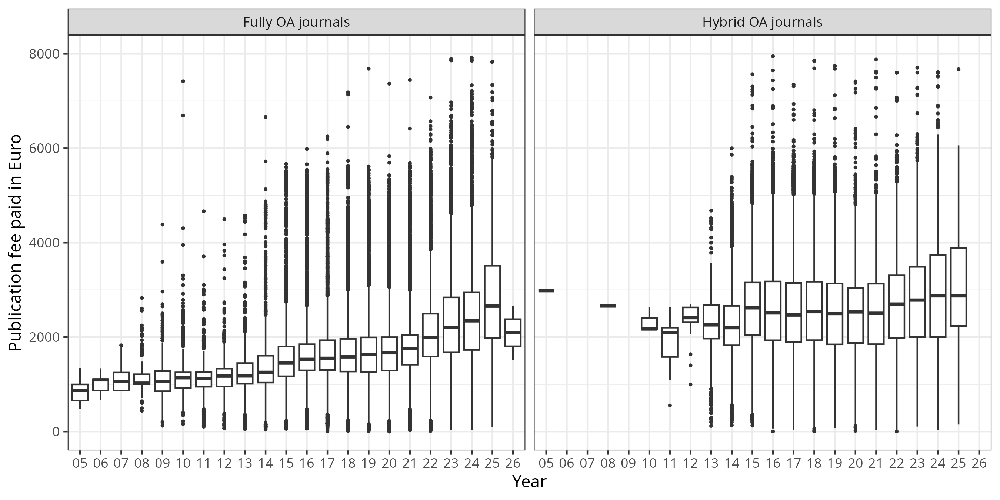
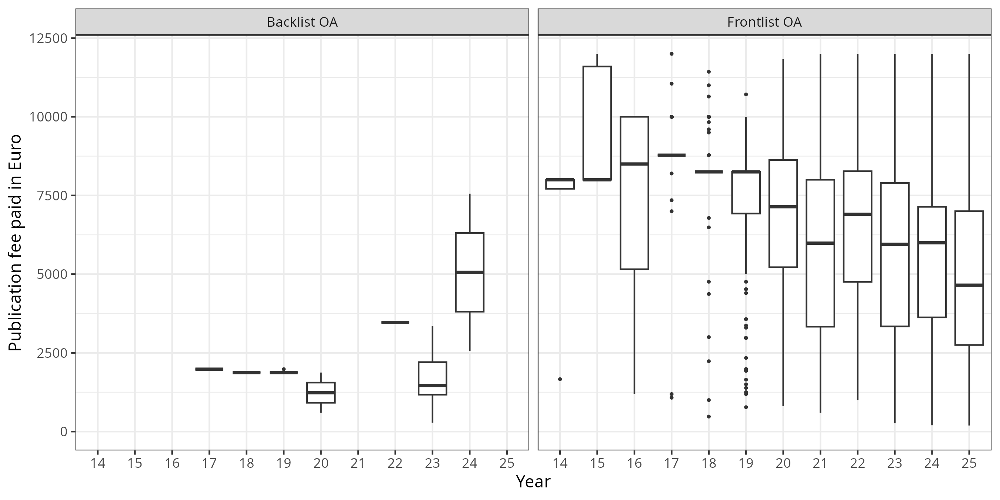

## About

The aim of this repository is:

- to release data sets on fees paid for Open Access journal articles and monographs by Universities and Research Society Funds under an Open Database License
- to demonstrate how reporting on fee-based Open Access publishing can be made more transparent and reproducible across institutions.

At the moment this project provides the following cost data:

| Publication Type | Count           | Aggregated Sum (€)      | Contributing Institutions              |
|------------------|-----------------|-------------------------|----------------------------------------|
| Articles         |189,450 | 366,545,622    | 402 |
| Monographs       |1,685 | 11,032,535    | 40 |

## How to access the data?

There are several options. You may simply download the the raw data sets in CSV format, query our [OLAP server](https://github.com/OpenAPC/openapc-olap/blob/master/HOWTO.md) or use our [Treemap site](https://treemaps.openapc.net/) for visual data exploration.

| Dataset         | CSV File                                                                                                                                                         | OLAP Cube                                                               | Treemap                                                               |
|-----------------|------------------------------------------------------------------------------------------------------------------------------------------------------------------|-------------------------------------------------------------------------|-----------------------------------------------------------------------|
| articles        | [APC file](https://github.com/OpenAPC/openapc-de/blob/master/data/apc_de.csv), [data schema](https://github.com/OpenAPC/openapc-de/wiki/schema#openapc-data-set) | [APC cube](https://olap.openapc.net/cube/openapc/aggregate)             | [APC treemap](https://treemaps.openapc.net/apcdata/openapc/)          |
| monographs      | [BPC file](https://github.com/OpenAPC/openapc-de/blob/master/data/bpc.csv), [data schema](https://github.com/OpenAPC/openapc-de/wiki/schema#bpc-data-set)        | [BPC cube](https://olap.openapc.net/cube/bpc/aggregate)                 | [BPC treemap](https://treemaps.openapc.net/apcdata/bpc/)              |

Our latest data release can always be accessed via the following DOI:

## How to contribute?

Any academic institution or research funder paying for Article Process Charges (APCs) or Book Processing Charges (BPCs) can contribute to OpenAPC, no formal registration is required.
This [page](https://github.com/OpenAPC/openapc-de/wiki/Data-Submission-Handout) ([German version](https://github.com/OpenAPC/openapc-de/wiki/Handreichung-Dateneingabe)) explains the details. The following institutions have contributed to OpenAPC so far:

## Institutions from Germany 

###  Higher education institutions 

- [Aachen University of Applied Sciences](https://www.fh-aachen.de/fh-aachen/arbeiten/servicestellen-fuer-beschaeftigte/bibliotheksservices-fuer-beschaeftigte/forschen-publizieren/publikationsfonds-forschung)
- [Bamberg University](https://www.uni-bamberg.de/en/library/publishing/oa-publishing/)
- [Bauhaus-Universität Weimar](https://www.uni-weimar.de/en/university/structure/central-university-facilities/university-library/research/open-access/open-access-publication-fund/)
- [Bayreuth University](http://www.ub.uni-bayreuth.de/en/digitale_bibliothek/open_access/index.html)
- [Bielefeld University](http://oa.uni-bielefeld.de/publikationsfonds.html)
- [Carl von Ossietzky Universität Oldenburg](https://uol.de/en/bis/research-publishing/open-access/open-access-publication-fund)
- [Catholic University of Eichstätt-Ingolstadt](https://www.ku.de/bibliothek/forschen-und-publizieren/open-access)
- [Charité - Universitätsmedizin Berlin](https://bibliothek.charite.de/publizieren/open_access)
- [Christian-Albrechts-Universität zu Kiel](https://www.ub.uni-kiel.de/en/open-access-publishing/open-access)
- [Clausthal University of Technology](https://www.ub.tu-clausthal.de/publizieren-open-access/open-access-publizieren/publikationsfonds)
- [Eberhard Karls Universität Tübingen](https://uni-tuebingen.de/en/facilities/university-library/publishing-research/publishing/open-access-publication-fund/)
- [Freie Universität Berlin](https://www.fu-berlin.de/sites/open_access/finanzierung-oa/zeitschriftenartikel/publikationsfonds_zeitschriften/index.html)
- [Friedrich-Alexander-Universität Erlangen-Nürnberg](https://ub.fau.de/schreiben-publizieren/open-access/dfg-gefoerderter-publikationsfonds/)
- [Friedrich-Schiller-Universität Jena](https://www.thulb.uni-jena.de/services/forschung-/-lehre/open-access-/-elektronisches-publizieren#c3516)
- [Hamburg University of Applied Sciences](https://www.haw-hamburg.de/hibs/publizieren/publikationsfonds/)
- [Hamburg University of Technology](https://www.tub.tu-harburg.de/publizieren/openaccess/)
- [Heidelberg University](http://www.ub.uni-heidelberg.de/Englisch/service/openaccess/publikationsfonds.html)
- [Heinrich-Heine-Universität Düsseldorf](https://www.ulb.hhu.de/en/reseach-teaching-publishing/open-access/hhus-open-access-fund)
- [Hochschule Bonn-Rhein-Sieg](https://www.h-brs.de/en/bib/publication-fund)
- [Hochschule Düsseldorf](https://bib.hs-duesseldorf.de/en)
- [Hochschule Hannover](https://www.hs-hannover.de/ueber-uns/organisation/bibliothek/services/publizieren-an-der-hsh/)
- [Hochschule für Technik und Wirtschaft Dresden](https://www.htw-dresden.de/open-access)
- [Humboldt-Universität zu Berlin](https://www.ub.hu-berlin.de/de/forschen-publizieren/open-access/finanzierung/publikationsfonds-zeitschriftenartikel)
- [JLU Gießen](https://www.uni-giessen.de/ub/en/digitales-publizieren-en/openaccess-en/oafonds-en?set_language=en)
- [Johann Wolfgang Goethe-Universität Frankfurt am Main](https://www.ub.uni-frankfurt.de/publizieren/publikationsfonds.html)
- [Johannes Gutenberg University of Mainz](https://www.ub.uni-mainz.de/de/open-access/foerderkriterien-open-access)
- [Leibniz Universität Hannover](https://tib.eu/oafonds)
- [Leipzig University](https://www.ub.uni-leipzig.de/open-science/publikationsfonds/)
- [Ludwig-Maximilians-Universität München](http://www.en.ub.uni-muenchen.de/writing/open-access-publishing/funding/index.html)
- [Martin Luther Universität Halle-Wittenberg](https://bibliothek.uni-halle.de/dbib/openaccess/)
- [Medizinische Hochschule Brandenburg Theodor Fontane](https://www.mhb-fontane.de/open-access-publikationsfonds-482.html)
- [Münster University](https://www.uni-muenster.de/Publizieren/service/publikationsfonds/)
- [Osnabrück University](https://www.ub.uni-osnabrueck.de/publizieren_archivieren/open_access/publikationsfonds.html)
- [Otto-von-Guericke-Universität Magdeburg](https://www.ub.ovgu.de/en/Publication+_+Open+Access/Open+Access/Publication+Fund+for+Articles.html)
- [Philipps University of Marburg](https://www.uni-marburg.de/de/ub/forschen/open-access/open-access-publikationsfonds)
- [RWTH Aachen](https://www.ub.rwth-aachen.de/cms/ub/Forschung/Wissenschaftliches-Publizieren/~iigq/Open-Access-Die-neue-Art-zu-publizieren/)
- [Rheinische Friedrich-Wilhelms-Universität Bonn](https://www.open-access.uni-bonn.de/de)
- [Ruhr Universität Bochum](http://www.ruhr-uni-bochum.de/oa/)
- [Saarland University](https://www.sulb.uni-saarland.de/lernen/open-access/open-access-publikationsfonds/)
- TU Bergakademie Freiberg
- [Technische Hochschule Brandenburg](https://bibliothek.th-brandenburg.de/open-access-und-publizieren/open-access/)
- [Technische Hochschule Wildau](https://www.th-wildau.de/hochschule/zentrale-einrichtungen/hochschulbibliothek/open-access-und-publikationsdienste/publikationsfonds/)
- [Technische Universität Berlin](http://www.ub.tu-berlin.de/publikationsfonds/)
- [Technische Universität Braunschweig](https://ub.tu-braunschweig.de/publikationsfonds/englisch/index_en.php)
- [Technische Universität Chemnitz](https://www.tu-chemnitz.de/ub/publizieren/openaccess/index.html.en)
- [Technische Universität Darmstadt](https://www.ulb.tu-darmstadt.de/service/elektronisches_publizieren/oa_publikationsfond/index.en.jsp)
- [Technische Universität Dortmund](https://ub.tu-dortmund.de/forschen-publizieren/open-access/)
- [Technische Universität Dresden](https://www.slub-dresden.de/veroeffentlichen/open-access-finanzieren)
- [Technische Universität Ilmenau](https://www.tu-ilmenau.de/universitaet/quicklinks/universitaetsbibliothek/forschen-publizieren/open-access/open-access-finanzierung/open-access-publikationsfonds)
- [Technische Universität München](https://www.ub.tum.de/en/publishing-fund)
- [Ulm University](https://www.uni-ulm.de/en/einrichtungen/kiz/service-katalog/wid/publikationsmanagement/open-access/open-access/)
- [University Medical Center Hamburg-Eppendorf](https://www.uke.de/forschung/open-science/publikationsfoerderung/index.html)
- [University of Applied Sciences Bielefeld](https://www.fh-bielefeld.de/open-access/publikationsfonds)
- [University of Applied Sciences Potsdam](https://www.fh-potsdam.de/campus-services/bibliothek/open-access-publizieren#section-18181)
- [University of Bremen](http://www.suub.uni-bremen.de/home-english/refworks-and-publishing/open-access-in-bremen-2/)
- University of Duisburg-Essen
- [University of Freiburg](https://www.ub.uni-freiburg.de/en/support/electronic-publishing/open-access/open-access-publication-fund/)
- [University of Greifswald](https://ub.uni-greifswald.de/en/service/for-academics/open-access/funding/)
- [University of Göttingen](http://www.sub.uni-goettingen.de/en/electronic-publishing/open-access/open-access-publication-funding/)
- [University of Kassel](http://www.uni-kassel.de/go/publikationsfonds)
- [University of Konstanz](https://www.kim.uni-konstanz.de/en/openscience/publishing-and-open-access/funding-open-access/)
- [University of Mannheim](https://www.bib.uni-mannheim.de/en/open-access-publishing-fund/)
- [University of Passau](https://www.ub.uni-passau.de/publizieren/open-access/publikationsfonds/)
- [University of Potsdam](https://publishup.uni-potsdam.de/home/index/help/content/publication_fund)
- [University of Regensburg](http://oa.uni-regensburg.de/)
- [University of Rostock](https://www.ub.uni-rostock.de/en/wissenschaftliche-services/open-access/open-access-foerdermoeglichkeiten/open-access-publikationsfonds-der-universitaet-rostock/)
- [University of Siegen](https://www.ub.uni-siegen.de/index.php?id=1510&L=1)
- [University of Stuttgart](https://oa.uni-stuttgart.de/publizieren/fonds/)
- [University of Trier](https://www.uni-trier.de/bibliothek/forschen-publizieren/open-access/open-access-publikationsfonds)
- [University of Veterinary Medicine Hannover, Foundation](http://www.tiho-hannover.de/de/kliniken-institute/bibliothek/open-access/publikationsfonds-an-der-tiho/)
- [University of Würzburg](https://www.bibliothek.uni-wuerzburg.de/en/research-publishing/open-access/publication-fund/)
- [Universität Erfurt](https://www.uni-erfurt.de/bibliothek/forschen-und-publizieren/publizieren-1/open-access-publikationsfonds)

###  Research institutes 

####  Fraunhofer Society 

- [Fraunhofer-Gesellschaft Publishing Fund](https://www.openaccess.fraunhofer.de/en/open-access-strategy.html)

####  Helmholtz Association 

- [Deutsches Elektronen-Synchrotron DESY](https://library.desy.de/open_access/publishing_options_for_authors/)
- [Deutsches Zentrum für Luft- und Raumfahrt](https://www.dlr.de/zb/en/desktopdefault.aspx/tabid-8234/)
- [Forschungszentrum Jülich](https://www.fz-juelich.de/zb/DE/Leistungen/Open_Access/publikationsfonds/publikationsfonds_node.html)
- [GEOMAR - Helmholtz Centre for Ocean Research Kiel](https://www.geomar.de/en/centre/central-facilities/bibliothek/author-services/publication-costs)
- [GFZ German Research Centre for Geosciences](https://www.gfz-potsdam.de/en) (data provided by the [Library Wissenschaftspark Albert Einstein](http://bib.telegrafenberg.de/en/publishing/open-access/))
- [Helmholtz-Zentrum Dresden-Rossendorf](http://www.hzdr.de/db/Cms?pNid=73)
- [Helmholtz-Zentrum für Umweltforschung – UFZ](https://www.ufz.de/index.php?en=36297)
- [KIT Karlsruhe](http://www.bibliothek.kit.edu/cms/kit-publikationsfonds.php)
- [Max Delbrück Center for Molecular Medicine (MDC)](https://www.mdc-berlin.de/about_the_mdc/structure/administration/library/oa?mdcbl%5B0%5D=/library&mdctl=0&mdcou=0&mdcot=0&mdcbv=nqe3t2xG8PGtPtxTs7kNhLVIaYkEwltgLl3DWBohxeI)

####  Leibniz Association 

- [DIPF | Leibniz-Institut für Bildungsforschung und Bildungsinformation](https://www.dipf.de/en/knowledge-resources/dipfdocs-open-access?set_language=en)
- [GIGA German Institute of Global and Area Studies](https://www.giga-hamburg.de/en/giga-open-access-guidelines)
- [IGB - Leibniz-Institute of Freshwater Ecology and Inland Fisheries](https://www.igb-berlin.de/en/library)
- [INM - Leibniz Institute for New Materials](https://www.ntnm-bib.de/open-access/publikationsfonds/)
- [IPN - Leibniz Institute for Science and Mathematics Education](http://www.ipn.uni-kiel.de/en/the-ipn/library/open-access)
- [Leibniz-Fonds](https://www.leibniz-gemeinschaft.de/en/research/open-science-and-digitalisation/open-access)
- [Leibniz-Institut für Festkörper- und Werkstoffforschung Dresden](https://www.ifw-dresden.de/about-us/library)
- [Leibniz-Institut für Raumbezogene Sozialforschung (IRS)](https://leibniz-irs.de/en/research/publications/open-access)
- [Paul-Drude-Institut für Festkörperelektronik](http://www.pdi-berlin.de/home/)
- [Potsdam Institute for Climate Impact Research (PIK)](https://www.pik-potsdam.de) (data provided by the [Library Wissenschaftspark Albert Einstein](http://bib.telegrafenberg.de/en/publishing/open-access/))
- [TIB – German National Library of Science and Technology](https://www.tib.eu/en/service/tib-open-access-policy/)
- [WIAS - Weierstrass Institute for Applied Analysis and Stochastics](https://www.wias-berlin.de/services/library/)

####  Max Planck Society 

- [Max Planck Digital Library](http://www.mpdl.mpg.de/21-specials/50-open-access-publishing.html) (The data content covers APCs as paid for by the central budget for the Max Planck Society (MPS). APCs funded locally by Max Planck Institutes are not part of the data. The MPS has a limited input tax reduction. The refund of input VAT for APC is 20%. Until the end of 2007 the MPS was VAT exempt.)

###  Other institutions 

- [Institut für Arbeitsmarkt- und Berufsforschung (IAB)](https://iab.de/en/the-iab/aufgaben-und-leitlinien-en/open-access/)
- [Knowledge Unlatched](http://www.knowledgeunlatched.org/)
- [OA-Monofonds Brandenburg](https://open-access-brandenburg.de/fonds/)
- [SWP - German Institute for International and Security Affairs](https://www.swp-berlin.org/en/)

- Hannover U und TIB

## Institutions from Austria 

- [AC2T Research GmbH](https://www.ac2t.at/en/)
- [Carinthia University of Applied Sciences (CUAS)](https://www.fh-kaernten.at/en/)
- [Danube University Krems University for Continuing Education](https://www.donau-uni.ac.at/en.html)
- [FH Campus Wien - University of Applied Sciences](https://www.fh-campuswien.ac.at/en)
- [FH Joanneum - University of Applied Sciences](https://www.fh-joanneum.at/en/)
- [FH Kufstein Tirol - University of Applied Sciences](https://www.fh-kufstein.ac.at/eng/)
- [FH Salzburg - University of Applied Sciences](https://www.fh-salzburg.ac.at/en/)
- [FH St. Pölten - University of Applied Sciences](https://www.fhstp.ac.at/en)
- [FH Vorarlberg - University of Applied Sciences](https://www.fhv.at/en/)
- [FHWien der WKW (FHW)](https://www.fh-wien.ac.at/en/)
- [FWF - Austrian Science Fund](https://www.fwf.ac.at/en/research-funding/open-access-policy/)
- [Ferdinand Porsche FernFH](https://www.fernfh.ac.at/en)
- [Graz University of Technology](https://www.tugraz.at/en/home)
- [Institute for Advanced Studies Vienna](https://www.ihs.ac.at/)
- [Institute of Science and Technology Austria](https://ist.ac.at/en/research/library/publish-communicate/)
- [International Institute for Applied Systems Analysis (IIASA)](https://iiasa.ac.at/)
- [Johannes Kepler University Linz](https://www.jku.at/en/library/service/bibliometrics-and-publication-support/open-access-publishing/publication-fund/)
- [Medical University of Graz](https://www.medunigraz.at/en/)
- [Medical University of Innsbruck](https://www.i-med.ac.at/mypoint/index.xml.en)
- [Medical University of Vienna](https://www.meduniwien.ac.at/web/en/)
- [Modul University Vienna (MUVIENNA)](https://www.modul.ac.at/)
- [Montanuniversität Leoben](https://www.unileoben.ac.at/en/)
- [Paracelsus Medical University](https://www.pmu.ac.at/en/home.html)
- Research Institute of Molecular Pathology (IMP) / IMBA - Institute of Molecular Biotechnology / Gregor Mendel Institute of Molecular Plant Biology
- [Technische Universität Wien](https://www.tuwien.at/en/library/research-and-publishing/funding)
- [University of Applied Sciences Burgenland](https://www.fh-burgenland.at/en/)
- [University of Applied Sciences Upper Austria](https://www.fh-ooe.at/en/)
- [University of Applied Sciences Wiener Neustadt for Business and Engineering](https://www.fhwn.ac.at/en/)
- [University of Graz](https://www.uni-graz.at/en/)
- [University of Innsbruck](https://www.uibk.ac.at/en/)
- University of Innsbruck and Medical University of Innsbruck
- [University of Klagenfurt](https://www.aau.at/en/)
- [University of Natural Resources and Life Sciences Vienna (BOKU)](https://boku.ac.at/en/)
- [University of Salzburg](https://www.plus.ac.at/university-library/services/open-access/open-access-policy/?lang=en)
- [University of Veterinary Medicine Vienna](https://www.vetmeduni.ac.at/en/)
- [University of Vienna](https://www.univie.ac.at/en/)
- [Vienna University of Economics and Business (WU)](https://www.wu.ac.at/en/)

## Institutions from Switzerland 

- [Agroscope](https://www.agroscope.admin.ch/agroscope/en/home.html)
- [Bern University of Applied Sciences](http://www.bfh.ch/)
- [ETH Zürich](https://library.ethz.ch/en/publishing-and-archiving/publishing-and-registering/publishing-in-open-access-journals.html)
- [Eawag - Swiss Federal Institute of Aquatic Science and Technology](https://www.eawag.ch/en/) (via [Lib4RI](https://www.lib4ri.ch/services/open-access.html))
- [Empa - Swiss Federal Laboratories for Materials Science and Technology](https://www.empa.ch/) (via [Lib4RI](https://www.lib4ri.ch/services/open-access.html))
- [European Organization for Nuclear Research](https://home.web.cern.ch/)
- [Forschungsinstitut für biologischen Landbau FiBL](https://www.fibl.org/en)
- [Graduate Institute of International and Development Studies](http://graduateinstitute.ch/home.html)
- [Haute École Pédagogique BEJUNE](https://www.hep-bejune.ch/)
- [Haute École Pédagogique Fribourg](https://hepfr.ch/)
- [Haute École Pédagogique du Canton de Vaud](https://www.hepl.ch/accueil.html)
- [Hochschule Luzern](https://www.hslu.ch/de-ch/hochschule-luzern/campus/bibliotheken/open-access-zugang-zu-wissenschaftlichen-arbeiten/)
- [Kalaidos University of Applied Sciences](https://www.kalaidos-fh.ch/de-CH/)
- [Lib4RI - Library for the Research Institutes within the ETH Domain Eawag, Empa, PSI & WSL](https://www.lib4ri.ch/services/open-access.html)
- [Medicines for Malaria Venture](https://www.mmv.org/)
- [OST University of Applied Science of Eastern Switzerland](https://www.ost.ch/en/)
- [PSI - Paul Scherrer Institute](https://www.psi.ch/en)
- [Pädagogische Hochschule Bern](https://www.phbern.ch/)
- [Pädagogische Hochschule Luzern](https://www.phlu.ch/)
- [Pädagogische Hochschule Thurgau](https://www.phtg.ch/)
- [Pädagogische Hochschule Zürich](https://phzh.ch/de/Forschung/grundsatze/open-access/)
- [Schwyz University of Teacher Education](https://www.phsz.ch/en/)
- [St.Gallen University of Teacher Education](https://www.phsg.ch/en)
- [Swiss Federal University for Vocational Education and Training](https://www.sfuvet.swiss/)
- [Swiss National Science Foundation (SNSF)](http://www.snf.ch/en/theSNSF/research-policies/open-access/Pages/default.aspx#OA%202020%20Policy)
- [Swiss Ornithological Institute](https://www.vogelwarte.ch/de/home/)
- [University of Applied Sciences and Arts Northwestern Switzerland](https://www.fhnw.ch/en)
- [University of Applied Sciences and Arts Western Switzerland](https://www.hes-so.ch/en/homepage)
- [University of Applied Sciences and Arts of Southern Switzerland](https://www.supsi.ch/home_en.html)
- [University of Applied Sciences in Business Administration Zurich](https://fh-hwz.ch/english/)
- [University of Applied Sciences of the Grisons](https://www.fhgr.ch/en/)
- [University of Basel](https://ub.unibas.ch/de/digitale-dienste/open-access/)
- [University of Bern](https://www.ub.unibe.ch/services/open_science/open_access/oa_fonds/index_eng.html)
- [University of Fribourg](https://www.unifr.ch/home/en/)
- [University of Geneva](https://www.unige.ch/)
- [University of Lausanne](https://www.unil.ch/openscience/en/home/menuinst/open-access/open-access-a-lunil/soutien-360/voie-doree/gold-open-access-fund-unil.html)
- [University of Neuchatel](https://www.unine.ch/)
- [University of St.Gallen](https://www.unisg.ch/)
- [University of Teacher Education Zug](https://www.zg.ch/behoerden/direktion-fur-bildung-und-kultur/phzg/university-of-teacher-education-zug)
- [University of Teacher Education in Special Needs](https://www.hfh.ch/en)
- [University of Zurich](https://www.ub.uzh.ch/de/wissenschaftlich-arbeiten/publizieren/Open-Access.html)
- [Università della Svizzera italiana](https://www.usi.ch/en)
- [Universität Luzern](https://www.zhbluzern.ch/en/services/research-publish#WzU1Mzhd/)
- [WSL - Swiss Federal Institute for Forest, Snow and Landscape Research](https://www.wsl.ch/en/index.html)
- [ZHAW Zurich University of Applied Sciences](https://www.zhaw.ch/en/library/writing-publishing/publishing-and-open-access/oa-at-the-zhaw/#c112481)
- [Zurich University of the Arts](https://www.zhdk.ch/miz/miz-oa)
- [École Polytechnique Fédérale de Lausanne](https://www.epfl.ch/en/)

## Institutions from Italy 

- [Consiglio Nazionale Delle Ricerche (CNR)](https://www.cnr.it/en/cnr-open-access)
- [Free University of Bozen-Bolzano](https://www.unibz.it/en/services/library/publishing-at-unibz/unibz-open-access-publishing-fund/)
- [Università degli Studi di Milano](https://www.unimi.it/en)
- [Università degli Studi di Modena e Reggio Emilia](https://international.unimore.it/)
- [Veneto Institute of Oncology (IOV IRCCS)](https://www.ioveneto.it/unit/gestione-documentazione-scientifica/)

## Institutions from Norway 

- Akershus University Hospital
- BI Norwegian Business School
- Bergen University College
- Fridtjof Nansen Institute
- GenØk - Centre for Biosafety
- Harstad University College
- Innlandet Hospital Trust
- Institute of Marine Research
- Molde University College
- Nansen Environmental and Remote Sensing Center
- Nord University
- Norwegian Center for Studies on Violence and Traumatic Stress
- Norwegian Institute for Agricultural and Environmental Research
- Norwegian Institute for Air Research
- Norwegian Institute for Nature Research
- Norwegian Institute of Public Health
- Norwegian Institute of Water Research
- Norwegian School of Sport Sciences
- Norwegian University of Life Sciences
- Norwegian University of Science and Technology
- Oslo University Hospital
- Oslo and Akershus University College
- SINTEF (Foundation for Scientific and Industrial Research)
- Sørlandet Hospital Trust
- Uni Research
- University College of Southeast Norway
- University of Agder
- University of Bergen
- University of Oslo
- University of Stavanger
- University of Tromsø - The Arctic University of Norway
- Vestfold Hospital Trust
- Vestre Viken Hospital Trust

## Institutions from Spain 

- [Universitat de Barcelona](http://crai.ub.edu/en/crai-services/open-access-ub)

## Institutions from Sweden 

- BTH Blekinge Institute of Technology
- Chalmers University of Technology
- Dalarna University
- Halmstad University
- [Institute Mittag-Leffler](http://www.mittag-leffler.se/)
- Jönköping University
- KTH Royal Institute of Technology
- Karlstad University
- Karolinska Institutet
- [Kristianstad University](https://www.hkr.se/en/)
- Linköping University
- Linnaeus University
- Luleå University of Technology
- Lund University
- Malmö University
- [Marie Cederschiöld University](https://www.mchs.se/)
- [Medical Products Agency](https://www.lakemedelsverket.se/en)
- [Mid Sweden University](https://www.miun.se/en)
- Mälardalen University
- [Public Health Agency of Sweden](https://www.folkhalsomyndigheten.se/the-public-health-agency-of-sweden/)
- [RISE Research Institutes of Sweden](https://www.ri.se/en)
- [Sophiahemmet University College](https://www.shh.se/en/)
- Stockholm School of Economics
- Stockholm University
- [Swedish Defence Research Agency](https://www.foi.se/en/foi.html)
- [Swedish Museum of Natural History](https://www.nrm.se/en/16.html)
- [Swedish National Road and Transport Research Institute (VTI)](https://www.vti.se/en/)
- Swedish School of Sport and Health Sciences
- Swedish University of Agricultural Sciences
- Södertörns University
- [The Swedish Environmental Protection Agency](https://www.naturvardsverket.se/en)
- Umeå University
- University West
- University of Borås
- University of Gothenburg
- University of Gävle
- University of Skövde
- Uppsala University
- Örebro University

## Institutions from Finland 

- Aalto University
- [Arcada University of Applied Sciences](https://www.arcada.fi/en)
- Finnish Environment Institute
- [Finnish Food Authority](https://www.ruokavirasto.fi/)
- [Finnish Government](https://valtioneuvosto.fi/en/frontpage)
- [Finnish Institute for Health and Welfare](https://thl.fi/en/web/thlfi-en)
- [Finnish Institute of Occupational Health](https://www.ttl.fi/en)
- [Finnish Meteorological Institute](https://en.ilmatieteenlaitos.fi/)
- [Geological Survey of Finland](https://www.gtk.fi/en/)
- Haaga-Helia University of Applied Sciences
- [Hanken School of Economics](https://www.hanken.fi/en)
- Häme University of Applied Sciences
- JAMK University of Applied Sciences
- [LAB University of Applied Sciences](https://www.lab.fi/en)
- Lapin ammattikorkeakoulu (Lapland University of Applied Sciences)
- [Lappeenranta-Lahti University of Technology LUT](https://www.lut.fi/en)
- [Laurea University of Applied Sciences](https://www.laurea.fi/en/)
- [Metropolia University of Applied Sciences](https://www.metropolia.fi/en)
- [National Land Survey of Finland](https://www.maanmittauslaitos.fi/en)
- Natural Resources Institute Finland
- [Novia University of Applied Sciences](https://www.novia.fi/novia-uas/)
- [Oulu University of Applied Sciences](https://www.oamk.fi/en/)
- Satakunta University of Applied Sciences
- Seinäjoki University of Applied Sciences
- [Social Insurance Institution of Finland](https://www.kela.fi/about-kela-library)
- South-Eastern Finland University of Applied Sciences (Xamk)
- [Tampere University](https://libguides.tuni.fi/open-access/introduction)
- [Tampere University of Applied Sciences](https://www.tuni.fi/fi/tutustu-meihin/tamk)
- The National Defence University Finland
- [Turku University of Applied Sciences](https://www.tuas.fi/en/)
- University of Applied Sciences Savonia
- [University of Eastern Finland](https://www.uef.fi/en/etusivu)
- [University of Helsinki](https://www.helsinki.fi/en)
- [University of Jyväskylä](https://openscience.jyu.fi/en/open-access-publishing)
- [University of Lapland](https://lib.luc.fi/research)
- [University of Oulu](https://www.oulu.fi/en)
- [University of Turku](https://utuguides.fi/openaccess)
- [University of Vaasa](https://www.uwasa.fi/en)
- [University of the Arts Helsinki](https://www.uniarts.fi/en/)
- [VAMK University of Applied Sciences](https://www.vamk.fi/en/)
- [VATT Institute for Economic Research](https://vatt.fi/etusivu)
- VTT Technical Research Centre of Finland
- Åbo Akademi University

## Institutions from France 

- Agence nationale de sécurité du médicament et des produits de santé
- [Agence nationale de sécurité sanitaire de l'alimentation, de l'environnement et du travail (ANSES)](https://www.anses.fr/en)
- AgroParisTech
- Aix-Marseille Université
- Avignon Université
- CHU de Rennes
- CentraleSupélec
- Centre de coopération internationale en recherche agronomique pour le développement (CIRAD)
- Centre national de la recherche scientifique (CNRS)
- Commissariat à l'énergie atomique et aux énergies alternatives (CEA)
- Conservatoire national des arts et métiers
- ENS de Lyon
- ENSTA Bretagne
- EURECOM
- Ecole centrale de Lyon
- Ecole normale supérieure de Paris
- Ecole polytechnique
- European Synchrotron Radiation Facility (ESRF)
- French institutions
- Hospices Civils de Lyon
- IMT Atlantique Bretagne Pays de la Loire
- INSA de Lyon
- Institut Français de Recherche pour l'Exploitation de la Mer
- Institut Laue-Langevin
- Institut National des Sciences Appliquées de Strasbourg
- Institut Pasteur
- Institut de radioprotection et de sûreté nucléaire
- Institut de recherche pour le développement (IRD)
- Institut français des sciences et technologies des transports, de l'aménagement et des réseaux (IFSTTAR)
- Institut national de la recherche agronomique (INRA)
- Institut national de la santé et de la recherche médicale (INSERM)
- Institut national de recherche en informatique et en automatique (INRIA)
- Institut national de recherche en sciences et technologies pour l'environnement et l'agriculture (IRSTEA)
- Institut national de recherche pour l'agriculture, l'alimentation et l'environnement (INRAE)
- Institut national polytechnique de Toulouse(INPT)
- Institut supérieur d'agriculture Rhône-Alpes
- La Rochelle Université
- Laboratoire national de métrologie et d'essais - LNE
- Le Mans Université
- MINES ParisTech
- Museum National d'Histoire Naturelle
- Office National d'Etudes et de Recherches Aérospatiales (ONERA)
- Paris 8 Vincennes - Saint-Denis
- Sciences Po Paris
- Sorbonne Université
- Université Claude Bernard Lyon 1
- Université Clermont Auvergne
- Université Evry Val-d'Essonne
- Université Grenoble Alpes
- Université Gustave Eiffel
- Université Jean Moulin - Lyon III
- Université Lille 1
- Université Lille 2
- Université Louis Lumière - Lyon II
- Université Paris 1 Panthéon-Sorbonne
- [Université Paris Cité](https://u-paris.fr/en/)
- Université Paris Dauphine-PSL
- Université Paris Descartes (Paris V)
- Université Paris Diderot (Paris VII)
- Université Paris Nanterre
- Université Paris-Est Marne-la-Vallée
- Université Pierre et Marie Curie (Paris VI)
- Université Polytechnique Hauts-de-France
- Université Savoie Mont Blanc
- Université Technologique de Compiègne
- Université Toulouse III
- Université d'Angers
- Université d'Orléans
- Université de Bordeaux
- Université de Bordeaux Montaigne
- Université de Bourgogne
- Université de Bretagne Occidentale
- Université de Bretagne-Sud
- Université de Caen Normandie
- Université de Côte d'Azur
- Université de Franche-Comté
- Université de Haute-Alsace
- Université de La Réunion
- Université de Lille
- Université de Lorraine
- Université de Montpellier
- Université de Nantes
- Université de Nouvelle Calédonie
- Université de Nîmes
- Université de Pau et des Pays de l'Adour
- Université de Perpignan - Via Domitia
- Université de Picardie Jules Verne
- Université de Poitiers
- Université de Reims Champagne Ardenne
- Université de Rennes 1
- Université de Rennes 2
- Université de Strasbourg
- Université de Toulon
- Université de Tours
- Université de Versailles-Saint-Quentin-en-Yvelines
- Université de technologie de Troyes
- Université des Antilles
- Université du Havre
- Université du Littoral Côte d'Opale
- École Nationale de l'Aviation Civile
- [École des Hautes Etudes en Santé Publique (EHESP)](https://www.ehesp.fr/en/)
- École nationale du génie de l'eau et de l'environnement de Strasbourg
- École nationale supérieure d'ingénieurs de Caen
- [École nationale vétérinaire d'Alfort (EnvA)](https://www.vet-alfort.fr/)
- École supérieure de physique et de chimie industrielles de la Ville de Paris (ESPCI)

## Institutions from the United Kingdom 

- Aberystwyth University
- [Anglia Ruskin University](https://www.aru.ac.uk/)
- Aston University
- Bangor University
- Birkbeck, University of London
- [Birmingham City University](https://www.bcu.ac.uk/)
- [Bournemouth University](https://www.bournemouth.ac.uk/)
- Brunel University
- [Cardiff Metropolitan University](https://www.cardiffmet.ac.uk/Pages/default.aspx)
- Cardiff University
- [City University London](https://www.city.ac.uk/)
- Cranfield University
- [Edge Hill University](https://www.edgehill.ac.uk/)
- Edinburgh Napier University
- Glasgow Caledonian University
- Goldsmiths, University of London
- Heriot-Watt University
- Imperial College London
- Institute of Cancer Research (ICR)
- Keele University
- King's College London
- [Kingston University](https://www.kingston.ac.uk/)
- Lancaster University
- Leeds Beckett University
- Liverpool John Moores University
- Liverpool School of Tropical Medicine
- London School of Economics (LSE)
- London School of Hygiene & Tropical Medicine (LSHTM)
- London South Bank University
- Manchester Metropolitan University
- [Natural History Museum](https://www.nhm.ac.uk/)
- Northumbria University
- [Nottingham Trent University](https://www.ntu.ac.uk/)
- Oxford Brookes University
- Plymouth University
- [Queen Margaret University](https://www.qmu.ac.uk/)
- Queen Mary University of London
- Queen's University Belfast
- [Robert Gordon University](https://www.rgu.ac.uk/)
- [Royal Botanic Gardens](https://www.kew.org/)
- Royal Holloway, University of London
- Royal Veterinary College
- SOAS University of London
- [Scotland's Rural College](https://www.sruc.ac.uk/)
- [Sheffield Hallam University](https://libguides.shu.ac.uk/OpenAccess/)
- St George's, University of London
- Swansea University
- The Open University
- [University Campus Suffolk](https://www.uos.ac.uk/)
- University College London (UCL)
- University of Aberdeen
- [University of Abertay Dundee](https://www.abertay.ac.uk/)
- University of Bath
- [University of Bedfordshire](https://www.beds.ac.uk/)
- University of Birmingham
- [University of Bradford](https://www.bradford.ac.uk/external/)
- University of Bristol
- University of Cambridge
- [University of Central Lancashire](https://www.uclan.ac.uk/)
- [University of Chester](https://www1.chester.ac.uk/)
- [University of Derby](https://www.derby.ac.uk/)
- University of Dundee
- University of Durham
- University of East Anglia
- University of Edinburgh
- University of Exeter
- University of Glasgow
- [University of Greenwich](https://www.gre.ac.uk/)
- University of Huddersfield
- University of Hull
- University of Kent
- University of Leeds
- University of Leicester
- [University of Lincoln](http://www.lincoln.ac.uk/home/)
- University of Liverpool
- University of Loughborough
- University of Manchester
- University of Newcastle
- [University of Northampton](https://www.northampton.ac.uk/)
- University of Nottingham
- University of Oxford
- University of Portsmouth
- University of Reading
- [University of Roehampton](https://www.roehampton.ac.uk/)
- University of Salford
- University of Sheffield
- University of Southampton
- University of St Andrews
- [University of Stirling](https://www.stir.ac.uk/)
- University of Strathclyde
- University of Surrey
- University of Sussex
- University of Ulster
- [University of Wales Trinity St David](https://www.uwtsd.ac.uk/)
- University of Warwick
- [University of West of Scotland](https://www.uws.ac.uk/home/)
- [University of Westminster](https://www.westminster.ac.uk/)
- [University of Worcester](https://www.worcester.ac.uk/)
- University of York
- [University of the Highlands and Islands](https://www.uhi.ac.uk/en/)
- University of the West of England
- [Wellcome Trust](https://wellcome.ac.uk/funding/managing-grant/open-access-policy)

## Institutions from the Czech Republic 

- [Charles University](https://cuni.cz/UKEN-1.html)
- [University of Chemistry and Technology, Prague](https://www.chemtk.cz/en/)
- [VSB - Technical University of Ostrava](https://www.vsb.cz/en)

## Institutions from Hungary 

- [University of Debrecen](https://unideb.hu/en)

## Institutions from Serbia 

- [University of Belgrade](http://bg.ac.rs/en/)

## Institutions from Belgium 

- [University of Liège](https://www.uliege.be/cms/c_8699436/en/uliege)

## Institutions from the United States 

- [Bill & Melinda Gates Foundation](https://www.gatesfoundation.org/how-we-work/general-information/open-access-policy)
- [Harvard University](https://osc.hul.harvard.edu/programs/hope/)
- [Indiana University - Purdue University Indianapolis (IUPUI)](https://ulib.iupui.edu/digitalscholarship/openaccess/oafund)
- [Thomas Jefferson University](https://library.jefferson.edu/pub/open_access.cfm)
- [University of Rhode Island](https://uri.libguides.com/oafund)
- [Virginia Polytechnic Institute and State University](http://guides.lib.vt.edu/oa)

## Institutions from Canada 

- [University of Calgary](https://library.ucalgary.ca/oa/)

## Institutions from Qatar 

- [Qatar National Library](https://www.qnl.qa/en)

## Institutions from Malawi 

- Malawi-Liverpool-Wellcome Clinical Research-Programme

## Institutions from Thailand 

- Mahidol Oxford Tropical Medicine Research Unit

## Institutions from Vietnam 

- Oxford University Clinical Research Unit

## Institutions from Greece 

- [OpenAIRE (FP7 Post-Grant OA Pilot)](https://digital-strategy.ec.europa.eu/en/news/results-fp7-post-grant-open-access-pilot)

## Institutions from the Netherlands 

- [Academic Medical Center (AMC)](https://www.amc.nl/web/home.htm)
- [Academisch Centrum Tandheelkunde Amsterdam (ACTA)](https://acta.nl/en/)
- [Delft University of Technology](https://www.tudelft.nl/en/)
- [Eindhoven University of Technology](https://www.tue.nl/en/)
- [Erasmus University Medical Center](https://www.erasmusmc.nl/en/)
- [Erasmus University Rotterdam](https://www.eur.nl/en)
- [Hubrecht Institute for Developmental Biology and Stem Cell Research](https://www.hubrecht.eu/)
- [International Institute of Social History (IISH)](https://iisg.amsterdam/en)
- [Leiden University](https://www.universiteitleiden.nl/en)
- [Leiden University Medical Center (LUMC)](https://www.lumc.nl/)
- [Maastricht University](https://www.maastrichtuniversity.nl/)
- [Maastricht University Medical Center (UMC+)](https://www.mumc.nl/en)
- [Meertens Institute](https://meertens.knaw.nl/en/)
- [Netherlands Institute for Advanced Study in the Humanities and Social Sciences (NIAS)](https://nias.knaw.nl/)
- [Netherlands Institute for Neuroscience](https://nin.nl/)
- [Netherlands Institute of Ecology](https://nioo.knaw.nl/en)
- [Netherlands Interdisciplinary Demographic Institute (NIDI)](https://nidi.nl/en/)
- [Open University of The Netherlands](https://www.ou.nl/en/)
- [Radboud University](https://www.ru.nl/en)
- [Radboud University Medical Center](https://www.radboudumc.nl/en/research)
- [Rathenau Institute](https://www.rathenau.nl/en)
- [Royal Netherlands Academy of Arts and Sciences Bureau (KNAW Bureau)](https://www.knaw.nl/en)
- [Tilburg University](https://www.tilburguniversity.edu/)
- [University Medical Center Groningen (UMCG)](https://www.umcg.nl/)
- [University Medical Center Utrecht](https://www.umcutrecht.nl/en)
- [University of Amsterdam](https://www.uva.nl/en)
- [University of Groningen](https://www.rug.nl/)
- [University of Twente](https://www.utwente.nl/en/)
- [Utrecht University](https://www.uu.nl/en)
- [VU University Amsterdam](https://vu.nl/en)
- [VU University Medical Center (VUmc)](https://www.vumc.nl/)
- [Wageningen University and Research Centre](https://www.wur.nl/en.htm)
- [Westerdijk Fungal Biodiversity Center (CBS)](https://wi.knaw.nl/)

## Institutions from Liechtenstein 

- [University of Liechtenstein](https://www.uni.li/study/de/)

## Data sets

*Note: The following numbers and plots are always based on the [latest revision](https://github.com/OpenAPC/openapc-de/releases/latest) of the OpenAPC data set. The underlying code can be found in the associated [R Markdown template](README.Rmd).*

### Articles (APCs)

The article data set contains information on 189,450 open access journal articles being published in fully and hybrid open access journal. Publication fees for these articles were supported financially by 402 research performing institutions and research funders. 

In total, article publication fee spending covered by the OpenAPC initiative amounted to € 366,545,622. The average payment was € 1,935 and the median was € 1,788.

133,395 articles in the data set were published in fully open access journals. Total spending on publication fees for these articles amounts to € 226,593,595, including value-added tax; the average payment was € 1,699 (median =  € 1,624, SD = € 796).

Hybrid open access journals rely on both publication fees and subscriptions as revenue source. 56,055 articles in the data set were published in hybrid journals. Total expenditure amounts to 139,952,027 €; the average fee was € 2,497 (median =  € 2,462, SD = € 1,010).

#### Spending distribution over fully and hybrid open access journals

#### Spending distribution details

|period | OA articles| OA mean| OA median|    OA min - max| Hybrid Articles| Hybrid mean| Hybrid median| Hybrid min - max|
|:------|-----------:|-------:|---------:|---------------:|---------------:|-----------:|-------------:|----------------:|
|2005   |           7|     858|       871| 480.00 -  1,350|               1|       2,983|         2,983| 2,983.3 -  2,983|
|2006   |          52|   1,021|     1,095| 665.00 -  1,340|              NA|          NA|            NA|               NA|
|2007   |          88|   1,081|     1,062| 870.00 -  1,825|              NA|          NA|            NA|               NA|
|2008   |         205|   1,170|     1,025| 440.80 -  2,830|               1|       2,660|         2,660| 2,660.0 -  2,660|
|2009   |         359|   1,185|     1,060| 124.63 -  4,386|              NA|          NA|            NA|               NA|
|2010   |         401|   1,261|     1,139| 158.79 -  7,419|               3|       2,318|         2,173| 2,152.0 -  2,630|
|2011   |         777|   1,158|     1,127| 104.85 -  4,666|               7|       1,687|         2,072|   552.0 -  2,631|
|2012   |       1,577|   1,173|     1,175|  69.00 -  4,498|              20|       2,308|         2,412|   997.4 -  2,700|
|2013   |       2,472|   1,229|     1,178|  50.00 -  4,574|           1,098|       2,257|         2,260|   120.2 -  4,679|
|2014   |       5,192|   1,375|     1,255|  40.00 -  9,028|           6,521|       2,238|         2,200|   132.3 -  6,000|
|2015   |       8,447|   1,522|     1,448|  59.00 -  5,669|           6,696|       2,609|         2,621|   126.6 -  8,636|
|2016   |       9,845|   1,636|     1,530|  62.51 -  5,985|           7,895|       2,551|         2,513|     2.3 -  9,079|
|2017   |      14,913|   1,700|     1,553|   8.71 - 14,634|          10,618|       2,530|         2,470|    36.9 -  9,858|
|2018   |      16,175|   1,701|     1,581|  13.00 -  8,926|           9,469|       2,550|         2,538|     1.8 -  9,073|
|2019   |      16,451|   1,685|     1,623|  10.72 -  7,684|           6,328|       2,502|         2,443|    75.3 -  9,500|
|2020   |      18,897|   1,685|     1,676|   0.01 -  8,906|           3,306|       2,378|         2,384|   130.0 -  7,416|
|2021   |      23,621|   1,803|     1,780|  27.03 -  6,417|           2,873|       2,493|         2,475|    30.2 - 11,400|
|2022   |      13,610|   2,039|     1,961|  12.36 -  9,044|           1,167|       2,733|         2,730|     2.1 - 11,988|
|2023   |         306|   2,052|     2,012| 297.50 -  5,579|              52|       2,782|         2,948|   860.0 -  5,536|

### Books (BPCs)

The book data set contains information on 1,685 open access books. Publication fees were supported financially by 40 research performing institutions and funders. 

In total, book processing charges covered by the OpenAPC initiative amounted to € 11,032,535. The average payment was € 6,547 and the median was € 6,902.

Books can be made Open Access right from the beginning ("frontlist") or only retroactively after having been published traditionally in the first place ("backlist"), which can have a big influence on the paid BPCs.

#### Spending distribution over frontlist and backlist OA books

#### Spending distribution details

|period | Frontlist books| mean BPC| median BPC|  BPC min - max| Backlist books| mean BPC| median BPC| BPC min - max|
|:------|---------------:|--------:|----------:|--------------:|--------------:|--------:|----------:|-------------:|
|2014   |              62|   15,043|     16,000| 1,663 - 20,000|             NA|       NA|         NA|            NA|
|2015   |              44|   14,676|     14,000| 8,000 - 20,000|             NA|       NA|         NA|            NA|
|2016   |              42|   12,449|     14,000| 1,190 - 22,000|             NA|       NA|         NA|            NA|
|2017   |             184|    9,250|      8,780| 1,075 - 21,000|            195|    1,981|      1,981| 1,981 - 1,981|
|2018   |             148|    8,953|      8,250|   476 - 21,104|            191|    1,875|      1,875| 1,875 - 1,875|
|2019   |             171|    7,833|      8,250|   774 - 22,000|            194|    1,876|      1,875| 1,875 - 1,981|
|2020   |             158|    7,526|      7,454|   802 - 19,200|              2|    1,235|      1,235|   595 - 1,875|
|2021   |             161|    7,159|      6,790|   595 - 18,000|             NA|       NA|         NA|            NA|
|2022   |             131|    8,418|      7,000| 1,190 - 50,000|              1|    3,467|      3,467| 3,467 - 3,467|
|2023   |               1|    6,000|      6,000| 6,000 -  6,000|             NA|       NA|         NA|            NA|

## Use of external sources

Metadata representing publication titles or publisher names is obtained from Crossref in order to avoid extensive validation of records. Cases where we don't re-use information from Crossref to disambiguate the spending metadata are documented [here](python/test/test_apc_csv.py). Moreover, indexing coverage in Europe PMC and the Web of science is automatically checked.

### Articles 

|Source     |Variable  |Description                     |
|:--------------|:---------|:-----------------------------------------------|
|CrossRef   |`publisher` |Title of Publisher             |
|CrossRef   |`journal_full_title` |Full title of the journal  |
|CrossRef   |`issn` |International Standard Serial Numbers (collapsed) |
|CrossRef   |`issn_print` |ISSN print |
|CrossRef   |`issn_electronic`  |ISSN electronic        |
|CrossRef   |`license_ref`  |License of the article     |
|CrossRef   |`indexed_in_crossref`  |Is the article metadata registered with CrossRef? (logical)    |
|EuropePMC    |`pmid`  |PubMed ID                 |
|EuropePMC    |`pmcid` |PubMed Central ID         |
|Web of Science |`ut` |Web of Science record ID             |
|DOAJ           |`doaj` |Is the journal indexed in the DOAJ? (logical)    |

### Books

|Source     |Variable  |Description                     |
|:--------------|:---------|:-----------------------------------------------|
|CrossRef   |`publisher` |Title of Publisher             |
|CrossRef   |`book_title` |Full Title of a Book  |
|CrossRef   |`isbn` |International Standard Book Number |
|CrossRef   |`isbn_print` |ISBN print |
|CrossRef   |`isbn_electronic`  |ISBN electronic        |
|CrossRef   |`license_ref`  |License of the article     |
|CrossRef   |`indexed_in_crossref`  |Is the article metadata registered with CrossRef? (logical)    |
|DOAB           |`doab` |Is the book indexed in the DOAB? (logical)    |

Indexing coverage

|Identifier                 | Coverage                                                          |
|:--------------------------|:------------------------------------------------------------------|
|DOI                        |  99.71%       |
|PubMed ID                  |  73.57%      |
|PubMed Central ID          |  67.81%     |
|Web of Science record ID   | 87.9%      |

## License

The data sets are made available under the Open Database License: http://opendatacommons.org/licenses/odbl/1.0/. Any rights in individual contents of the database are licensed under the Database Contents License: http://opendatacommons.org/licenses/dbcl/1.0/

This work is licensed under the Creative Commons Attribution 4.0 Unported License.

## How to cite?

When citing this data set, please indicate the [release](https://github.com/OpenAPC/openapc-de/releases/) you are referring to. The releases also contain information on contributors relating to the respective release.

Please do not cite the master branch of the Github repository (https://github.com/OpenAPC/openapc-de/tree/master/), but use the release numbers/tags.

Bielefeld University Library archives a copy (including commit history). To cite:

{Contributors:} *Datasets on fee-based Open Access publishing across German Institutions*. Bielefeld University. [10.4119/UNIBI/UB.2014.18](http://dx.doi.org/10.4119/UNIBI/UB.2014.18)

## Acknowledgement

This project was set up in collaboration with the [DINI working group Electronic Publishing](http://dini.de/ag/e-pub1/). It follows [Wellcome Trust example to share data on paid APCs](http://blog.wellcome.ac.uk/2014/03/28/the-cost-of-open-access-publishing-a-progress-report/) and recognises efforts from [JISC](https://www.jisc-collections.ac.uk/News/Releasing-open-data-about-Total-Cost-of-Ownership/) and the [ESAC initative](http://esac-initiative.org/) to standardise APC reporting.

## Contributors

Jens Harald Aasheim, Sarah Abusaada, Benjamin Ahlborn, Chelsea Ambler, Magdalena Andrae, Jochen Apel, Myriam Bastin, Hans-Georg Becker, Roland Bertelmann, Daniel Beucke, Manuela Bielow, Peter Blume, Ute Blumtritt, Sabine Boccalini, Stefanie Bollin, Katrin Bosselmann, Valentina Bozzato, Kim Braun, Christoph Broschinski, Paolo Buoso, Cliff Buschhart, Dorothea Busjahn, Pablo de Castro, Ann-Kathrin Christann, Roberto Cozatl, Micaela Crespo Quesada, Amanda Cullin, Patrick Danowski, Gernot Deinzer, Julia Dickel, Andrea Dorner, Stefan Drößler, Karin Eckert, Carsten Elsner, Clemens Engelhardt, Olli Eskola, Katrin Falkenstein-Feldhoff, Ashley Farley, Inken Feldsien-Sudhaus, Silke Frank, Fabian Franke, Claudia Frick, Marléne Friedrich, Paola Galimberti, Agnes Geißelmann, Kai Karin Geschuhn, Silvia Giannini, Marianna Gnoato, Steffi Grimm, Birgit Hablizel, Florian Hagen, Christina Hemme, Ulrich Herb, Elfi Hesse, Dana Horch, Larissa Gordon, Ute Grimmel-Holzwarth, Evgenia Grishina, Christian Gutknecht, Uli Hahn, Kristina Hanig, Margit L. Hartung, Dominik Hell, Eike Hentschel, Ulrich Herb, Stephanie Herzog, Kathrin Höhner, Conrad Hübler, Christie Hurrell, Arto Ikonen, Doris Jaeger, Najko Jahn, Alexandra Jobmann, Daniela Jost, Tiina Jounio, Juho Jussila, Nadja Kalinna, Mirjam Kant, Andreas Kennecke, Robert Kiley, Ilka Kleinod, Lydia Koglin, Nives Korrodi, Biljana Kosanovic, Stephanie Kroiß, Gerrit Kuehle, Stefanie Kutz, Marjo Kuusela, Anna Laakkonen, Ignasi Labastida i Juan, Gerald Langhanke, Inga Larres, Stuart Lawson, Anne Lehto, Sari Leppänen, Camilla Lindelöw, Maria Löffler, Jutta Lotz, Kathrin Lucht-Roussel, Susanne Luger, Jan Lüth, Frank Lützenkirchen, Steffen Malo, Anna Marini, Manuel Moch, Andrea Moritz, Max Mosterd, Marcel Nieme, Anja Oberländer, Martina Obst, Jere Odell, Linda Ohrtmann, Vitali Peil, Gabriele Pendorf, Mikko Pennanen, Dirk Pieper, Tobias Pohlmann, Thomas Porquet, Markus Putnings, Andrée Rathemacher, Rainer Rees-Mertins, Edith Reschke, Ulrike Richter, Katharina Rieck, Friedrich Riedel, Simone Rosenkranz, Florian Ruckelshausen, Steffen Rudolph, Ilka Rudolf, Pavla Rygelová, Lea Satzinger, Annette Scheiner, Isabo Schick, Michael Schlachter, Birgit Schlegel, Andreas Schmid, Barbara Schmidt, Katharina Schulz, Stefanie Seeh, Barbara Senkbeil-Stoffels, Adriana Sikora, Tereza Simandlová, Stefanie Söhnitz, Jana Sonnenstuhl, Lisa Spindler, Susanne Stemmler, Matti Stöhr, Eva Stopková, Marius Stricker, Andrea Stühn, Kálmán Szőke, Linda Thomas, Anne Timm, Laura Tobler, Johanna Tönsing, Marco Tullney,  Milan Vasiljevic, Astrid Vieler, Lena Vinnemann, Viola Voß, Christin Wacke, Roland Wagner, Agnieszka Wenninger, Kerstin Werth, Martin Wimmer, Marco Winkler, Sabine Witt, Michael Wohlgemuth, Verena Wohlleben, Qingbo Xu, Philip Young, Esther Zaugg, Miriam Zeunert, Philipp Zumstein

## Contact

For bugs, feature requests and other issues, please submit an issue via [Github](https://github.com/OpenAPC/openapc-de/issues/new).

For general comments, email openapc at uni-bielefeld.de

## Disclaimer

People, who are looking for "Open Advanced Process Control Software" for automation, visualization and process control tasks from home control up to industrial automation, please follow <http://www.openapc.com> (2015-09-30)
