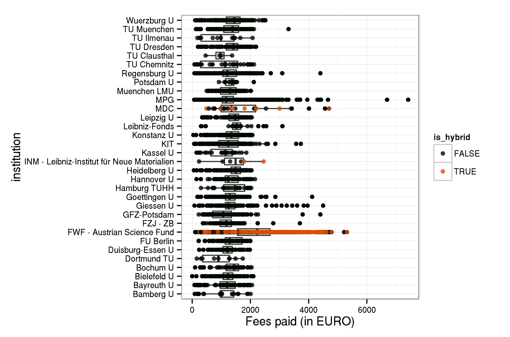

## About 

The aim of this repository is:

- to release datasets on fees paid for Open Access journal articles by German Universities under an Open Database License
- to share a copy of [Directory of Open Access Journals (DOAJ)](http://doaj.org/) journal master list (downloaded January 2014)
- to demonstrate how reporting on fee-based Open Access publishing can be made more transparent and reproducible across institutions.

## Participating Universities

So far, the following German universities have agreed to share information on paid author processing charges (APC):

- [Bielefeld University](http://oa.uni-bielefeld.de/publikationsfonds.html)
- [Clausthal University of Technology](http://www.ub.tu-clausthal.de/en/angebote-fuer-wissenschaftlerinnen/elektronisches-publizieren/publikationsfonds/)
- [Leibniz Universität Hannover](http://tib.uni-hannover.de/oafonds)
- [Leipzig University](https://www.ub.uni-leipzig.de/open-access/publikationsfonds/)
- [Free University of Berlin](http://www.fu-berlin.de/sites/open_access/dienstleistungen/artikelgebuehren/publikationsfonds/index.html)
- [KIT Karlsruhe](http://www.bibliothek.kit.edu/cms/kit-publikationsfonds.php)*
- [University of Bamberg](http://www.uni-bamberg.de/en/ub/publishing/open-access-publishing/open-access-funds/)
- [University of Duisburg-Essen](https://www.uni-due.de/ub/open_access.shtml)
- [University of Göttingen](http://www.sub.uni-goettingen.de/en/electronic-publishing/open-access/open-access-publication-funding/)
- [University of Konstanz](http://www.ub.uni-konstanz.de/openaccess/open-access-publikationsfonds-der-universitaet-konstanz/)
- [University of Regensburg](http://oa.uni-regensburg.de/)

* (KIT omitted DOI due to privacy concerns)

## Participating Research Society Funds in Germany

Dataset on funds that are supported by research societies under its Open-Access Publishing Programme.

Participating Research Organizations:

- [Max Planck Digital Library](http://www.mpdl.mpg.de/21-specials/50-open-access-publishing.html)

The data content covers APCs as paid for by our central budget for the Max Planck Society.  APCs funded locally by Max Planck Institutes are not part of this data set.  The Max Planck Society has a limited input tax reduction. The refund of input VAT for APC is 20%.

- [Forschungszentrum Jülich](http://www.fz-juelich.de/portal/DE/Home/home_node.html)
- [Library Wissenschaftspark Albert Einstein](http://bib.telegrafenberg.de/en/library-wissenschaftspark-albert-einstein/)

## Dataset

At the moment, the dataset releases information on 2166 articles, with total expenditure of 2635859.84€. Average fee is 1216.9€.

View dataset on [GitHub](https://github.com/njahn82/unibiAPC/blob/master/data/apc_de.csv).

|                 | Articles| Fees paid in EURO| Mean Fee paid|
|:----------------|--------:|-----------------:|-------------:|
|Bamberg U        |       16|          15932.11|        995.76|
|Bielefeld U      |      160|         187296.22|       1170.60|
|Duisburg-Essen U |      114|         130989.00|       1149.03|
|FU Berlin        |       45|          56074.43|       1246.10|
|FZJ - ZB         |       76|          90410.94|       1189.62|
|GFZ-Potsdam      |       60|          69625.47|       1160.42|
|Goettingen U     |      156|         191826.70|       1229.66|
|Hannover U       |       42|          53515.64|       1274.18|
|KIT              |      194|         228626.36|       1178.49|
|Konstanz U       |       85|         107776.13|       1267.95|
|Leipzig U        |       60|          79602.89|       1326.71|
|MPG              |      991|        1237803.62|       1249.05|
|Regensburg U     |      163|         182609.56|       1120.30|
|TU Clausthal     |        4|           3770.77|        942.69|

## Sample Visualisations

### Distribution over publishers by university

### Comparing fees paid by univeristy and research institution

### Average fees paid by publisher

### Average fees Max Planck Digital Library paid for Springer Open Access articles by year

For more examples see also [http://openapc.github.io/openapc-de/](http://openapc.github.io/openapc-de/)

## How to contribute?

In collaboration with the [DINI working group Electronic Publishing](http://dini.de/ag/e-pub1/), a [wiki page](https://github.com/OpenAPC/openapc-de/wiki/Handreichung-Dateneingabe)(in German) explains all the steps required. Meeting and telephone conferences are documented as well:

* [Virtual Meeting 19 August](https://github.com/OpenAPC/openapc-de/wiki/Protokoll-Kick-Off-19.-August)
* [Virtual Meeting 11 + 12 February 2015](https://github.com/OpenAPC/openapc-de/wiki/Ergebnisprotokoll-11-bzw.-12.-Februar-2015)

## Licence

The datasets are made available under the Open Database License: http://opendatacommons.org/licenses/odbl/1.0/. Any rights in individual contents of the database are licensed under the Database Contents License: http://opendatacommons.org/licenses/dbcl/1.0/ 

This work is licensed under the Creative Commons Attribution 4.0 Unported License.

## How to cite?

Bielefeld University Library archives a remote including version history. To cite:

Bertelmann, Roland; Beucke, Daniel; Deinzer, Gernot; Herb, Ulrich; Franke, Fabian; Frick, Claudia; Geschuhn, Kai Karin; Jaeger, Doris;  Lützenkirchen, Frank; Oberländer, Anja; 
Peil, Vitali; Pieper, Dirk; Schlachter, Michael; Schlegel, Birgit; Sikora, Adriana; Tullney, Marco; Vieler, Astrid; Witt, Sabine; Jahn, Najko; (2014): *Datasets on fee-based Open Access publishing across German Institutions*. Bielefeld University. [10.4119/UNIBI/UB.2014.18](http://dx.doi.org/10.4119/UNIBI/UB.2014.18)

## Acknowledgement

This project follows [Wellcome Trust example to share data on paid APCs](http://blog.wellcome.ac.uk/2014/03/28/the-cost-of-open-access-publishing-a-progress-report/). It recognises efforts from [JISC](https://www.jisc-collections.ac.uk/News/Releasing-open-data-about-Total-Cost-of-Ownership/) and the [ESAC initative](http://esac-initiative.org/) to standardise APC reporting. 

For data enrichment, sample visualisations and explorations we build on the work of [rOpenSci](http://ropensci.org/) and [LibreCat/Catmandu](http://librecat.org/).

## Contributors

Roland Bertelmann, Daniel Beucke, Gernot Deinzer, Ulrich Herb, Fabian Franke, Claudia Frick, Kai Karin Geschuhn, Doris Jaeger, Frank Lützenkirchen, Anja Oberländer, Vitali Peil, Dirk Pieper, Michael Schlachter, Birgit Schlegel, Adriana Sikora, Marco Tullney, Astrid Vieler, Sabine Witt, Najko Jahn

## Contact

For bugs, feature requests and other issues, please submit an issue via [Github](https://github.com/OpenAPC/openapc-de/issues/new).

For general comments, email najko.jahn at uni-bielefeld.de and dirk.pieper at uni-bielefeld.de
