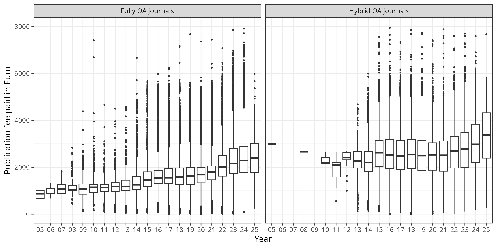

## About

The aim of this repository is:

- to release datasets on fees paid for Open Access journal articles by Universities and Research Society Funds under an Open Database License
- to demonstrate how reporting on fee-based Open Access publishing can be made more transparent and reproducible across institutions.

At the moment this project provides cost data on 46,011 open access journal articles, amounting to € 88,212,005 and contributed by 150 institutions.

&nbsp;&nbsp;([What's this?](https://github.com/OpenAPC/openapc-de/wiki/Data-Integrity-Testing))

## How to contribute?

Any academic institution or research funder paying for Article Process Charges (APCs) can contribute to OpenAPC, no formal registration is required.
This [page](https://github.com/OpenAPC/openapc-de/wiki/Data-Submission-Handout) ([German version](https://github.com/OpenAPC/openapc-de/wiki/Handreichung-Dateneingabe)) explains the details.

## Participating German Universities

So far, the following German universities have agreed to share information on paid author processing charges (APC):

- [Bayreuth University](http://www.ub.uni-bayreuth.de/en/digitale_bibliothek/open_access/index.html)
- [Bielefeld University](http://oa.uni-bielefeld.de/publikationsfonds.html)
- [Clausthal University of Technology](http://www.ub.tu-clausthal.de/en/angebote-fuer-wissenschaftlerinnen/elektronisches-publizieren/publikationsfonds/)
- [Freie Universität Berlin](http://www.fu-berlin.de/sites/open_access/finanzierung/publikationsfonds/index.html)
- [Friedrich-Alexander-Universität Erlangen-Nürnberg](https://ub.fau.de/schreiben-publizieren/open-access/dfg-gefoerderter-publikationsfonds/)
- [Hamburg University of Technology](https://www.tub.tu-harburg.de/publizieren/openaccess/)
- [Heidelberg University](http://www.ub.uni-heidelberg.de/Englisch/service/openaccess/publikationsfonds.html)
- [Leibniz Universität Hannover](https://tib.eu/oafonds)
- [Leipzig University](https://www.ub.uni-leipzig.de/forschungsbibliothek/projekte/projekte-chronologisch/open-access-publikationsfonds/)
- [Ludwig-Maximilians-Universität München](http://www.en.ub.uni-muenchen.de/writing/open-access-publishing/funding/index.html)
- [Münster University](https://www.uni-muenster.de/Publizieren/service/publikationsfonds/)
- [JGU Mainz](https://www.openaccess.uni-mainz.de/publikationsfonds-der-jgu/)
- [JLU Giessen](https://www.uni-giessen.de/ub/en/digitales-publizieren-en/openaccess-en/oajlu-en?set_language=en)
- [KIT Karlsruhe](http://www.bibliothek.kit.edu/cms/kit-publikationsfonds.php)
- [Ruhr Universität Bochum](http://www.ruhr-uni-bochum.de/oa/)
- [Technische Universität Chemnitz](https://www.tu-chemnitz.de/ub/publizieren/openaccess/index.html.en)
- [Technische Universität Dortmund](http://www.ub.tu-dortmund.de/open-access/index.html)
- [Technische Universität Dresden](http://www.slub-dresden.de/service/schreiben-publizieren/open-access-service/publikationsfonds/)
- [Technische Universität Ilmenau](https://www.tu-ilmenau.de/ub/service/open-access/oa-publikationsfonds/)
- [Technische Universität München](https://www.ub.tum.de/en/publishing-fund)
- [University of Bamberg](http://www.uni-bamberg.de/en/ub/publishing/open-access-publishing/open-access-funds/)
- [University of Bremen](http://www.suub.uni-bremen.de/home-english/refworks-and-publishing/open-access-in-bremen-2/)
- [University of Duisburg-Essen](https://www.uni-due.de/ub/en/openaccess_foerderung.shtml)
- [University of Freiburg](https://www.ub.uni-freiburg.de/unterstuetzung/elektronisch-publizieren/open-access/publikationsfonds/)
- [University of Göttingen](http://www.sub.uni-goettingen.de/en/electronic-publishing/open-access/open-access-publication-funding/)
- [University of Kassel](http://www.uni-kassel.de/go/publikationsfonds)
- [University of Konstanz](https://www.kim.uni-konstanz.de/en/services/scholarly-publishing-and-open-access/open-access-publication-funds/)
- [University of Oldenburg](http://www.bis.uni-oldenburg.de/en/teachingresearchingpublishing/publishing/openaccesspublishing/open-access-publication-fund/)
- [University of Potsdam](https://publishup.uni-potsdam.de/home/index/help/content/publication_fund)
- [University of Regensburg](http://oa.uni-regensburg.de/)
- [University of Tübingen](https://www.uni-tuebingen.de/en/facilities/university-library/researching-publishing/open-access-publikationsfonds.html)
- [University of Veterinary Medicine Hannover, Foundation (TiHo)](http://www.tiho-hannover.de/de/kliniken-institute/bibliothek/open-access/publikationsfonds-an-der-tiho/)
- [University of Würzburg](http://www.bibliothek.uni-wuerzburg.de/en/service0/electronic_publishing/open_access/open_access_journals/)
- [Ulm University](https://www.uni-ulm.de/index.php?id=57202)

## Participating Research Society Funds in Germany

Dataset on funds that are supported by research societies under its Open-Access Publishing Programme.

Participating Research Organizations:

- [Max Planck Digital Library](http://www.mpdl.mpg.de/21-specials/50-open-access-publishing.html)

The data content covers APCs as paid for by our central budget for the Max Planck Society (MPS). APCs funded locally by Max Planck Institutes are not part of this data set. The MPS has a limited input tax reduction. The refund of input VAT for APC is 20%. Until the end of 2007 the MPS was VAT exempt.

- [Forschungszentrum Jülich](http://www.fz-juelich.de/portal/DE/Home/home_node.html)
- [Helmholtz-Zentrum Dresden-Rossendorf](http://www.hzdr.de/db/Cms?pNid=73)
- [Helmholtz-Zentrum für Umweltforschung - UFZ](https://www.ufz.de/index.php?de=33573)
- [INM - Leibniz Institute for New Materials](http://bibliothek.inm-gmbh.de/publizieren/publikationsgebuhren/)
- [IPN - Leibniz Institute for Science and Mathematics Education](http://www.ipn.uni-kiel.de/en/the-ipn/library/open-access)
- [Leibniz Association's Open Access Publishing Fund](http://www.leibniz-gemeinschaft.de/en/infrastructures/open-access/open-access-publishing-fund/)
- [Library Wissenschaftspark Albert Einstein](http://bib.telegrafenberg.de/en/library-wissenschaftspark-albert-einstein/)
- [Max Delbrück Center for Molecular Medicine (MDC)](https://www.mdc-berlin.de/1161876/de/about_the_mdc/structure/administration/library)
- [Technische Informatonsbibliothek (TIB) - German National Library of Science and Technology](https://www.tib.eu/en/service/tib-open-access-policy/)

## Participating Austrian Institutions

- [FWF - Austrian Science Fund](https://www.fwf.ac.at/en/research-funding/open-access-policy/)
- [Institute of Science and Technology Austria](https://ist.ac.at/open-access/open-access-policy/)
- [Technische Universität Wien](http://www.ub.tuwien.ac.at/eng/openaccess)

## Participating Italian Institutions

- [Università degli Studi di Milano](http://www.unimi.it/ENG/)

## Institutions from Norway:

- Akershus University Hospital
- BI Norwegian Business School
- Bergen University College
- Fridtjof Nansen Institute
- GenØk - Centre for Biosafety
- Harstad University College
- Innlandet Hospital Trust
- Institute of Marine Research
- Molde University College
- NILU - Norwegian Institute for Air Research
- Nansen Environmental and Remote Sensing Center
- Nord University
- Norwegian Center for Studies on Violence and Traumatic Stress
- Norwegian Institute for Agricultural and Environmental Research
- Norwegian Institute for Nature Research
- Norwegian Institute of Public Health
- Norwegian Institute of Water Research
- Norwegian School of Sport Sciences
- Norwegian University of Life Sciences
- Norwegian University of Science and Technology
- Oslo University Hospital
- Oslo and Akershus university college
- SINTEF (Foundation for Scientific and Industrial Research)
- Sørlandet Hospital Trust
- Uni Research
- University College of Southeast Norway
- University of Agder
- University of Bergen
- University of Oslo
- University of Stavanger
- University of Tromsø - The Arctic University of Norway
- Vestfold Hospital Trust
- Vestre Viken Hospital Trust

## Participating Spanish Institutions:

- [Universitat de Barcelona](http://www.ub.edu/web/ub/en/index.html)

## Institutions from Sweden (via [Open APC Sweden](https://github.com/Kungbib/openapc-se)):

- Chalmers University of Technology
- Dalarna University College
- Karolinska Institutet
- KTH Royal Institute of Technology
- Linköping University
- Luleå University of Technology
- Lund University
- Malmö University College
- Stockholm University
- Swedish University of Agricultural Sciences
- Umeå University
- University of Gothenburg
- Uppsala University

## Participating Institutions from the United Kingdom:

- [Wellcome Trust](https://wellcome.ac.uk/funding/managing-grant/open-access-policy)
- [JISC](https://www.jisc-collections.ac.uk/Jisc-Monitor/APC-data-collection/)

Jisc Collections released data on APC payments made by UK higher education institutions (HEIs):

- Aberystwyth University
- Aston University
- Bangor University
- Cardiff University
- Cranfield University
- Goldsmiths
- Imperial College London
- Institute of Cancer Research (ICR)
- Keele University
- King's College London
- London School of Economics (LSE)
- London School of Hygiene & Tropical Medicine (LSHTM)
- Lancaster University
- Manchester Metropolitan University
- Northumbria University
- Plymouth University
- Queen Mary, University of London
- Queen's University Belfast
- Royal Holloway
- St George's, University of London
- Swansea University
- University College London (UCL)
- University of Aberdeen
- University of Bath
- University of Birmingham
- University of Bristol
- University of Cambridge
- University of Durham
- University of Edinburgh
- University of Exeter
- University of Glasgow
- University of Huddersfield
- University of Hull
- University of Leicester
- University of Liverpool
- University of Loughborough
- University of Manchester
- University of Newcastle
- University of Nottingham
- University of Oxford
- University of Portsmouth
- University of Reading
- University of Salford
- University of Sheffield
- University of Southampton
- University of St Andrews
- University of Surrey
- University of Sussex
- University of Warwick
- University of York

## Participating Institutions from the United States:

- [Harvard University](https://osc.hul.harvard.edu/programs/hope/)
- [Virginia Polytechnic Institute and State University](http://guides.lib.vt.edu/oa)

## Participating Canadian Institutions:

- [University of Calgary](http://library.ucalgary.ca/open-access-authors-fund)

## Supranational participants

- [OpenAIRE](https://www.openaire.eu/postgrantoapilot) (FP7 Post-Grant Open Access Pilot)

## Dataset

This dataset contains information on 46,011 open access journal articles being published in fully and hybrid open access journal. Publication fees for these articles were supported financially by 150 research performing institutions and research funders. 

In total, publication fee spending covered by the Open APC initiative amounted to € 88,212,005. The average payment was € 1,917  and the median was € 1,724.

View dataset on [GitHub](https://github.com/OpenAPC/openapc-de/blob/master/data/apc_de.csv) or take a look at our [treemap visualisations](http://treemaps.intact-project.org).

### Spending distribution over fully and hybrid open access journals

###  Fully Open Access Journals

26,069 articles in the dataset were published in fully open access journals. Total spending on publication fees for these articles amounts to € 38,430,813, including value-added tax; the average payment was € 1,474 (median =  € 1,392, SD = € 719).

The following table summarises institutional spending on articles published in fully open access journals.

|Institution                                                     | Articles| Spending total (in €)|     Mean (SD)| Median| Minimum - Maximum|
|:---------------------------------------------------------------|--------:|---------------------:|-------------:|------:|-----------------:|
|MPG                                                             |    3,436|             4,649,602|   1,353 (514)|  1,203|       69 -  7,419|
|UCL                                                             |    1,463|             2,391,591|   1,635 (900)|  1,526|       88 -  5,721|
|Wellcome Trust                                                  |    1,079|             1,906,002|   1,766 (820)|  1,607|      240 -  5,486|
|FWF - Austrian Science Fund                                     |    1,017|             1,542,862|   1,517 (741)|  1,398|      100 -  5,405|
|University of Calgary                                           |      884|               993,823|   1,124 (448)|  1,145|       50 -  4,632|
|Goettingen U                                                    |      849|             1,200,870|   1,414 (539)|  1,422|      139 -  4,830|
|Freiburg U                                                      |      623|               871,696|   1,399 (422)|  1,449|       50 -  2,501|
|Tuebingen U                                                     |      594|               814,355|   1,371 (423)|  1,386|       75 -  2,662|
|Imperial College London                                         |      563|             1,051,993|   1,869 (996)|  1,596|      269 -  5,439|
|Wuerzburg U                                                     |      562|               749,032|   1,333 (417)|  1,309|      105 -  2,514|
|TU Muenchen                                                     |      551|               713,150|   1,294 (484)|  1,439|      106 -  2,122|
|KIT                                                             |      542|               705,673|   1,302 (528)|  1,340|       69 -  3,731|
|OpenAIRE                                                        |      539|               782,833|   1,452 (423)|  1,413|      209 -  2,086|
|Erlangen Nuernberg U                                            |      538|               755,645|   1,405 (381)|  1,454|      124 -  2,286|
|Regensburg U                                                    |      484|               652,522|   1,348 (564)|  1,254|       77 -  4,403|
|University of Oxford                                            |      441|               952,824| 2,161 (1,160)|  1,898|      220 -  5,661|
|University of Cambridge                                         |      433|               943,714| 2,179 (1,202)|  1,807|      154 -  5,528|
|University of Birmingham                                        |      416|               717,371|   1,724 (781)|  1,680|      126 -  5,669|
|Giessen U                                                       |      415|               590,189|   1,422 (652)|  1,346|       81 -  4,498|
|Muenchen LMU                                                    |      407|               533,749|   1,311 (314)|  1,342|      496 -  2,123|
|Heidelberg U                                                    |      396|               586,179|   1,480 (386)|  1,614|       60 -  2,108|
|Universitat de Barcelona                                        |      373|               342,602|     919 (454)|    862|       55 -  2,000|
|Bielefeld U                                                     |      348|               437,899|   1,258 (330)|  1,276|      142 -  2,380|
|Swedish University of Agricultural Sciences                     |      343|               449,661|   1,311 (418)|  1,326|      124 -  2,765|
|Münster U                                                       |      325|               381,287|   1,173 (437)|  1,159|      168 -  2,380|
|Bremen U                                                        |      299|               389,718|   1,303 (455)|  1,285|      112 -  3,287|
|Konstanz U                                                      |      286|               422,405|   1,477 (537)|  1,452|       40 -  4,403|
|Leibniz-Fonds                                                   |      274|               439,562|   1,604 (604)|  1,570|       66 -  4,403|
|Leipzig U                                                       |      270|               386,841|   1,433 (346)|  1,504|      178 -  2,097|
|FZJ - ZB                                                        |      266|               336,279|   1,264 (552)|  1,165|      225 -  3,700|
|University of Manchester                                        |      247|               481,564|   1,950 (981)|  1,672|      431 -  4,888|
|Duisburg-Essen U                                                |      229|               309,648|   1,352 (489)|  1,276|      238 -  3,700|
|University of Liverpool                                         |      218|               359,858|   1,651 (694)|  1,624|      223 -  4,565|
|University of Oslo                                              |      218|               339,354|   1,557 (541)|  1,522|       70 -  3,522|
|JGU Mainz                                                       |      216|               304,319|   1,409 (429)|  1,383|      110 -  2,646|
|TU Dresden                                                      |      195|               274,112|   1,406 (420)|  1,449|      200 -  2,193|
|University of Bristol                                           |      193|               336,292|   1,742 (873)|  1,625|      131 -  5,520|
|University of Gothenburg                                        |      193|               295,543|   1,531 (606)|  1,406|      223 -  4,440|
|FU Berlin                                                       |      187|               255,545|   1,367 (505)|  1,410|      150 -  2,142|
|University of Tromsø - The Arctic University of Norway          |      179|               252,462|   1,410 (415)|  1,523|      496 -  2,404|
|King's College London                                           |      169|               345,648| 2,045 (1,078)|  1,593|      587 -  5,599|
|University of Edinburgh                                         |      159|               269,874|   1,697 (834)|  1,586|      226 -  4,689|
|Oldenburg U                                                     |      157|               189,277|   1,206 (488)|  1,342|       63 -  2,002|
|University of Bergen                                            |      156|               242,308|   1,553 (499)|  1,549|      333 -  5,142|
|Virginia Tech                                                   |      153|               165,423|   1,081 (472)|  1,216|      112 -  2,484|
|University of Sheffield                                         |      149|               254,086| 1,705 (1,066)|  1,497|      203 -  5,492|
|Cardiff University                                              |      148|               253,582|   1,713 (788)|  1,572|      204 -  4,497|
|University of Newcastle                                         |      142|               290,244| 2,044 (1,078)|  1,705|      360 -  5,985|
|Hannover U                                                      |      138|               181,409|   1,315 (497)|  1,392|      124 -  2,159|
|TiHo Hannover                                                   |      137|               194,193|   1,417 (468)|  1,416|      196 -  3,673|
|Bochum U                                                        |      130|               188,000|   1,446 (433)|  1,510|      100 -  2,648|
|Bayreuth U                                                      |      128|               148,565|   1,161 (526)|  1,202|       82 -  2,450|
|GFZ-Potsdam                                                     |      126|               148,862|   1,181 (755)|  1,082|      137 -  4,403|
|University of Southampton                                       |      120|               223,390| 1,862 (1,722)|  1,550|      388 - 18,802|
|Norwegian University of Science and Technology                  |      115|               162,119|   1,410 (492)|  1,420|      183 -  3,554|
|Queen's University Belfast                                      |      114|               184,597|   1,619 (667)|  1,543|      630 -  5,060|
|Oslo University Hospital                                        |      111|               149,777|   1,349 (373)|  1,392|      232 -  2,725|
|Ulm U                                                           |      108|               155,525|   1,440 (553)|  1,409|      260 -  5,284|
|KTH Royal Institute of Technology                               |      106|               129,263|   1,219 (806)|  1,072|      185 -  2,570|
|University of Glasgow                                           |      105|               206,779| 1,969 (1,083)|  1,483|      365 -  4,613|
|Linköping University                                            |       99|               155,146|   1,567 (723)|  1,355|      372 -  4,440|
|University of York                                              |       98|               166,773|   1,702 (884)|  1,529|      221 -  5,208|
|Harvard U                                                       |       94|                82,722|     880 (539)|    796|       75 -  3,139|
|Stockholm University                                            |       94|               143,268|   1,524 (647)|  1,402|      313 -  3,700|
|University of St Andrews                                        |       92|               164,030| 1,783 (1,045)|  1,522|      329 -  5,392|
|University of Warwick                                           |       74|               146,885| 1,985 (1,410)|  1,639|      442 -  9,028|
|MDC                                                             |       69|               137,459| 1,992 (1,207)|  1,483|      224 -  4,662|
|University of Nottingham                                        |       68|               124,918|   1,837 (798)|  1,626|      803 -  5,319|
|Norwegian Institute of Public Health                            |       63|                84,324|   1,338 (259)|  1,418|      400 -  1,766|
|University of Agder                                             |       62|                42,571|     687 (421)|    536|       86 -  2,145|
|Potsdam U                                                       |       60|                87,242|   1,454 (285)|  1,476|      224 -  2,116|
|University of Sussex                                            |       60|               114,274| 1,905 (1,071)|  1,537|      575 -  4,845|
|HZDR                                                            |       59|                89,634| 1,519 (1,048)|  1,209|      236 -  6,512|
|Milano U                                                        |       59|                90,625|   1,536 (845)|  1,483|      110 -  4,470|
|Kassel U                                                        |       55|                59,511|   1,082 (545)|  1,129|      150 -  2,321|
|TU Chemnitz                                                     |       55|                60,695|   1,104 (696)|  1,374|       78 -  2,123|
|University of Exeter                                            |       55|                96,969| 1,763 (1,081)|  1,395|      225 -  4,947|
|University of Reading                                           |       55|                87,306|   1,587 (515)|  1,587|      344 -  2,758|
|Norwegian University of Life Sciences                           |       53|                72,307|   1,364 (298)|  1,449|      481 -  1,678|
|University of Durham                                            |       49|                93,155| 1,901 (1,007)|  1,698|      225 -  5,219|
|LSHTM                                                           |       44|                75,734| 1,721 (1,655)|  1,529|      496 - 11,900|
|UFZ                                                             |       40|                42,186|   1,055 (404)|    979|      232 -  2,291|
|University of Leicester                                         |       39|                67,778|   1,738 (721)|  1,690|      418 -  4,765|
|Dortmund TU                                                     |       38|                39,184|   1,031 (901)|    962|      144 -  4,403|
|Bamberg U                                                       |       36|                39,450|   1,096 (572)|  1,116|       90 -  2,010|
|Oslo and Akershus university college                            |       36|                45,728|   1,270 (514)|  1,252|       86 -  2,238|
|Swansea University                                              |       36|                59,942|   1,665 (764)|  1,332|      840 -  4,689|
|University of Bath                                              |       34|                48,484|   1,426 (585)|  1,395|      360 -  2,429|
|Hamburg TUHH                                                    |       28|                38,431|   1,373 (500)|  1,418|      300 -  2,225|
|Queen Mary, University of London                                |       28|                46,664|   1,667 (938)|  1,436|      442 -  4,081|
|Dalarna University College                                      |       27|                38,434|   1,423 (619)|  1,698|      283 -  2,338|
|TU Ilmenau                                                      |       26|                31,545|   1,213 (590)|  1,408|      178 -  2,077|
|Aston University                                                |       24|                47,259|   1,969 (896)|  1,654|    1,324 -  4,845|
|TU Wien                                                         |       23|                32,403|   1,409 (421)|  1,323|      768 -  2,192|
|Bangor University                                               |       20|                46,857| 2,343 (2,940)|  1,638|      429 - 14,507|
|Northumbria University                                          |       20|                29,657|   1,483 (447)|  1,387|      682 -  2,369|
|Keele University                                                |       19|                32,082|   1,689 (401)|  1,644|    1,048 -  2,459|
|St George's, University of London                               |       19|                36,284|   1,910 (702)|  1,862|      575 -  3,991|
|Uni Research                                                    |       19|                28,070|   1,477 (610)|  1,474|      731 -  3,685|
|University College of Southeast Norway                          |       19|                19,107|   1,006 (584)|    907|      112 -  2,155|
|Norwegian Institute for Nature Research                         |       18|                23,241|   1,291 (390)|  1,264|      640 -  2,186|
|Lancaster University                                            |       17|                23,019|   1,354 (295)|  1,393|      700 -  1,825|
|University of Aberdeen                                          |       16|                30,434|   1,902 (839)|  1,787|      985 -  4,556|
|Institute of Cancer Research                                    |       15|                33,133| 2,209 (1,265)|  1,652|    1,205 -  5,118|
|Luleå University of Technology                                  |       15|                15,352|   1,023 (422)|  1,088|       95 -  1,599|
|Institute of Marine Research                                    |       14|                20,153|   1,439 (325)|  1,404|      966 -  2,129|
|LSE                                                             |       14|                26,721|   1,909 (822)|  1,798|      718 -  3,000|
|NILU - Norwegian Institute for Air Research                     |       14|                20,647|   1,475 (487)|  1,441|      661 -  2,462|
|Bergen University College                                       |       13|                19,984|   1,537 (511)|  1,713|      184 -  2,120|
|IST Austria                                                     |       13|                30,578| 2,352 (1,608)|  1,632|      562 -  5,412|
|Nord University                                                 |       12|                14,974|   1,248 (559)|  1,126|      101 -  2,045|
|Royal Holloway                                                  |       12|                20,914|   1,743 (904)|  1,512|      921 -  4,363|
|Akershus University Hospital                                    |       11|                15,680|   1,425 (402)|  1,290|      834 -  1,979|
|Cranfield University                                            |       10|                14,348|   1,435 (513)|  1,530|      228 -  2,067|
|Manchester Metropolitan University                              |       10|                14,997|   1,500 (521)|  1,421|      461 -  2,246|
|Plymouth University                                             |       10|                13,018|   1,302 (412)|  1,279|      631 -  2,250|
|Aberystwyth University                                          |        9|                18,176| 2,020 (1,119)|  1,569|    1,236 -  4,797|
|TU Clausthal                                                    |        8|                 6,999|     875 (514)|    918|      181 -  1,724|
|Umeå University                                                 |        8|                 6,104|     763 (362)|    724|      323 -  1,585|
|Uppsala University                                              |        8|                 6,467|     808 (619)|    691|      321 -  2,132|
|Karolinska Institutet                                           |        7|                 4,371|     624 (230)|    755|      199 -    755|
|Lund University                                                 |        7|                 6,555|     936 (715)|    755|      397 -  2,429|
|Nansen Environmental and Remote Sensing Center                  |        6|                 5,298|     883 (407)|    775|      582 -  1,655|
|University of Portsmouth                                        |        6|                 8,489|   1,415 (403)|  1,303|      887 -  1,915|
|GenØk - Centre for Biosafety                                    |        5|                 5,295|   1,059 (449)|  1,109|      400 -  1,650|
|INM - Leibniz-Institut für Neue Materialien                     |        5|                 5,744|   1,149 (560)|  1,305|      237 -  1,679|
|Norwegian Center for Studies on Violence and Traumatic Stress   |        5|                 4,605|     921 (342)|    953|      563 -  1,362|
|Sørlandet Hospital Trust                                        |        5|                 8,453|   1,691 (413)|  1,667|    1,194 -  2,337|
|University of Hull                                              |        5|                 7,548|   1,510 (447)|  1,635|      800 -  2,016|
|BI Norwegian Business School                                    |        4|                 2,761|     690 (398)|    724|      219 -  1,094|
|Fridtjof Nansen Institute                                       |        4|                 5,062|   1,265 (214)|  1,303|    1,010 -  1,446|
|Goldsmiths                                                      |        4|                 5,385|   1,346 (570)|  1,428|      608 -  1,921|
|IPN                                                             |        4|                 3,909|   977 (1,099)|    479|      330 -  2,621|
|Malmö University College                                        |        4|                 4,007|   1,002 (727)|    890|      346 -  1,882|
|University of Salford                                           |        4|                 5,714|   1,429 (657)|  1,480|      744 -  2,010|
|Vestfold Hospital Trust                                         |        4|                 6,134|   1,533 (286)|  1,532|    1,241 -  1,828|
|Vestre Viken Hospital Trust                                     |        4|                 5,796|   1,449 (360)|  1,555|      931 -  1,754|
|Chalmers University of Technology                               |        3|                 2,142|     714 (401)|    560|      413 -  1,169|
|Innlandet Hospital Trust                                        |        3|                 5,174|   1,725 (394)|  1,917|    1,271 -  1,985|
|Molde University College                                        |        3|                 1,876|     625 (257)|    584|      392 -    900|
|SINTEF                                                          |        3|                 3,633|   1,211 (145)|  1,176|    1,087 -  1,370|
|University of Huddersfield                                      |        3|                 3,452|   1,151 ( 88)|  1,192|    1,050 -  1,210|
|University of Surrey                                            |        3|                 4,732|   1,577 (723)|  1,628|      831 -  2,273|
|Harstad University College                                      |        2|                 2,024| 1,012 (1,310)|  1,012|       86 -  1,938|
|Norwegian Institute for Agricultural and Environmental Research |        2|                 2,389|   1,194 (  0)|  1,194|    1,194 -  1,194|
|Norwegian Institute of Water Research                           |        2|                 1,813|     906 ( 16)|    906|      895 -    918|
|Norwegian School of Sport Sciences                              |        2|                 1,568|     784 (500)|    784|      431 -  1,137|
|TIB                                                             |        1|                 1,619|   1,619 (  0)|  1,619|    1,619 -  1,619|
|University of Loughborough                                      |        1|                   968|     968 (  0)|    968|      968 -    968|
|University of Stavanger                                         |        1|                   709|     709 (  0)|    709|      709 -    709|

### Articles published in hybrid open access journals

Hybrid open access journals, which allow articles to be published immediately as open access after a charge was paid, rely on both publication fees and subscriptions as revenue source. This dataset covers 19,942 open access articles being published in hybrid journals. Total expenditure amounts to  49,781,193 €. Average  fee is 2,496 € and the median 2,450 €.

The following institutions have contributed expenditures on hybrid open access journal articles.

|Institution                                 | Articles| Spending total (in €)|     Mean (SD)| Median| Minimum - Maximum|
|:-------------------------------------------|--------:|---------------------:|-------------:|------:|-----------------:|
|FWF - Austrian Science Fund                 |    3,188|             7,778,679|   2,440 (778)|  2,599|      120 -  6,240|
|Wellcome Trust                              |    2,957|             7,629,551|   2,580 (898)|  2,565|      230 -  6,036|
|UCL                                         |    2,592|             5,697,517|   2,198 (963)|  1,973|      267 - 21,648|
|University of Cambridge                     |    1,285|             3,558,567| 2,769 (1,008)|  2,661|      127 -  6,213|
|University of Oxford                        |    1,036|             3,103,007| 2,995 (1,209)|  2,746|      224 -  9,070|
|Imperial College London                     |      856|             2,310,692|   2,699 (896)|  2,649|      260 -  6,511|
|University of Manchester                    |      831|             2,023,962|   2,436 (946)|  2,372|      169 -  7,133|
|University of Birmingham                    |      564|             1,382,054|   2,450 (909)|  2,480|      279 -  6,849|
|University of Bristol                       |      539|             1,302,739|   2,417 (882)|  2,274|      289 -  5,663|
|King's College London                       |      504|             1,355,709| 2,690 (1,006)|  2,640|      310 -  7,438|
|Cardiff University                          |      477|             1,204,676|   2,526 (768)|  2,571|      275 -  5,452|
|University of Sheffield                     |      417|             1,015,085|   2,434 (810)|  2,289|       66 -  5,837|
|University of Newcastle                     |      345|               953,699|   2,764 (969)|  2,640|      691 -  7,202|
|University of Liverpool                     |      328|               826,050|   2,518 (834)|  2,527|      132 -  5,199|
|University of Edinburgh                     |      295|               785,656|   2,663 (911)|  2,618|      620 -  5,624|
|University of Warwick                       |      262|               666,746|   2,545 (814)|  2,574|      739 -  5,208|
|University of Glasgow                       |      254|               695,826| 2,739 (1,022)|  2,547|      187 -  6,146|
|University of Durham                        |      253|               537,192|   2,123 (629)|  2,089|      224 -  3,788|
|University of Reading                       |      230|               529,529|   2,302 (759)|  2,313|      561 -  4,587|
|Swedish University of Agricultural Sciences |      154|               347,982|   2,260 (511)|  2,200|      731 -  3,582|
|Stockholm University                        |      151|               308,509|   2,043 (885)|  2,200|      295 -  5,502|
|University of York                          |      148|               366,141|   2,474 (839)|  2,389|      331 -  5,208|
|University of Bath                          |      146|               315,238|   2,159 (862)|  2,052|      113 -  4,822|
|University of Southampton                   |      137|               366,161| 2,673 (2,072)|  2,555|      293 - 25,070|
|University of Nottingham                    |      132|               340,936|   2,583 (915)|  2,627|      419 -  5,806|
|University of Loughborough                  |      123|               262,460|   2,134 (815)|  2,192|      287 -  4,132|
|University of St Andrews                    |      117|               259,582|   2,219 (799)|  2,165|      240 -  4,980|
|Swansea University                          |      109|               270,073|   2,478 (790)|  2,576|      890 -  5,267|
|University of Gothenburg                    |      105|               258,773|   2,465 (807)|  2,750|      246 -  4,463|
|University of Sussex                        |       97|               236,396|   2,437 (895)|  2,335|      331 -  5,188|
|University of Exeter                        |       95|               252,141|   2,654 (815)|  2,649|      337 -  4,639|
|Queen Mary, University of London            |       88|               192,096| 2,183 (1,250)|  1,927|      217 -  9,079|
|LSHTM                                       |       79|               199,854|   2,530 (706)|  2,287|    1,089 -  4,639|
|Aston University                            |       73|               159,488|   2,185 (850)|  2,178|      338 -  4,399|
|University of Leicester                     |       64|               171,209| 2,675 (1,062)|  2,604|      754 -  5,414|
|Cranfield University                        |       63|               178,932|   2,840 (820)|  2,929|      633 -  4,113|
|Lancaster University                        |       56|               135,977|   2,428 (919)|  2,381|      524 -  4,681|
|University of Calgary                       |       45|                91,902|   2,042 (390)|  2,184|      997 -  2,665|
|Institute of Cancer Research                |       43|               129,726|   3,017 (905)|  2,793|    1,315 -  5,296|
|Bangor University                           |       38|               104,790|   2,758 (845)|  2,726|      535 -  4,168|
|LSE                                         |       36|                65,882|   1,830 (808)|  2,045|      527 -  3,427|
|Lund University                             |       36|                71,500|   1,986 (660)|  2,132|      248 -  3,040|
|Queen's University Belfast                  |       34|                86,290|   2,538 (992)|  2,495|      281 -  4,490|
|Linköping University                        |       33|                69,756|   2,114 (717)|  2,132|      234 -  3,750|
|Royal Holloway                              |       31|                72,192| 2,329 (1,078)|  2,040|      687 -  5,210|
|KTH Royal Institute of Technology           |       30|                58,195|   1,940 (471)|  2,109|    1,166 -  2,959|
|Northumbria University                      |       28|                66,441| 2,373 (1,009)|  2,295|      596 -  4,513|
|MDC                                         |       27|                67,002| 2,482 (1,247)|  2,200|      491 -  4,936|
|University of Huddersfield                  |       27|                35,417|   1,312 (894)|    968|      607 -  3,220|
|Karolinska Institutet                       |       25|                38,269|   1,531 (877)|  1,473|      234 -  3,040|
|Keele University                            |       25|                65,045|   2,602 (356)|  2,644|    1,953 -  3,239|
|FZJ - ZB                                    |       23|                46,887|   2,039 (987)|  2,328|      322 -  3,833|
|St George's, University of London           |       23|                67,276|   2,925 (801)|  2,756|      621 -  5,208|
|Uppsala University                          |       23|                47,629|   2,071 (480)|  2,132|      935 -  2,630|
|IPN                                         |       22|                53,603|   2,437 (554)|  2,558|    1,181 -  3,540|
|Umeå University                             |       22|                43,072|   1,958 (832)|  2,132|      248 -  3,040|
|University of Aberdeen                      |       19|                53,694|   2,826 (909)|  2,681|      431 -  4,717|
|Plymouth University                         |       18|                44,466|   2,470 (602)|  2,482|    1,154 -  3,602|
|Ulm U                                       |       16|                33,672|   2,104 (548)|  2,319|    1,308 -  2,631|
|Manchester Metropolitan University          |       14|                29,724| 2,123 (1,052)|  2,180|      376 -  3,481|
|Virginia Tech                               |       14|                20,480|   1,463 (575)|  1,256|      633 -  2,337|
|Dalarna University College                  |       13|                33,705|   2,593 (933)|  2,690|      747 -  4,679|
|Luleå University of Technology              |       13|                28,385|   2,183 (908)|  2,429|      234 -  3,140|
|University of Hull                          |       10|                26,794|   2,679 (360)|  2,640|    2,247 -  3,225|
|INM - Leibniz-Institut für Neue Materialien |        9|                27,020|   3,002 (740)|  3,213|    1,785 -  3,861|
|Milano U                                    |        9|                15,735|   1,748 (861)|  1,969|      400 -  2,706|
|TiHo Hannover                               |        9|                16,412|   1,824 (928)|  1,595|      547 -  3,115|
|Chalmers University of Technology           |        7|                16,723|   2,389 (323)|  2,429|    2,132 -  3,040|
|Duisburg-Essen U                            |        7|                18,549|   2,650 ( 76)|  2,618|    2,577 -  2,800|
|MPG                                         |        7|                 6,262|     895 (127)|    971|      727 -  1,034|
|Aberystwyth University                      |        6|                16,115|   2,686 (792)|  2,775|    1,200 -  3,481|
|Malmö University College                    |        6|                14,883|   2,480 (197)|  2,530|    2,132 -  2,631|
|University of Portsmouth                    |        6|                13,412|   2,235 (751)|  2,652|    1,193 -  2,785|
|GFZ-Potsdam                                 |        5|                10,756| 2,151 (1,343)|  2,190|      134 -  3,795|
|Goldsmiths                                  |        5|                31,696| 6,339 (7,415)|  3,100|    1,969 - 19,542|
|University of Salford                       |        5|                13,547|   2,709 (239)|  2,662|    2,382 -  2,981|
|University of Surrey                        |        5|                15,095|   3,019 (480)|  2,769|    2,735 -  3,857|
|Hannover U                                  |        4|                 5,824|   1,456 (180)|  1,398|    1,323 -  1,704|
|IST Austria                                 |        3|                11,911| 3,970 (1,267)|  3,468|    3,031 -  5,412|
|GenØk - Centre for Biosafety                |        2|                 3,650|   1,825 (371)|  1,825|    1,563 -  2,087|
|HZDR                                        |        2|                 3,650| 1,825 (1,054)|  1,825|    1,080 -  2,570|
|Bergen University College                   |        1|                   503|     503 (  0)|    503|      503 -    503|
|Dortmund TU                                 |        1|                 1,581|   1,581 (  0)|  1,581|    1,581 -  1,581|
|Erlangen Nuernberg U                        |        1|                 1,638|   1,638 (  0)|  1,638|    1,638 -  1,638|
|FU Berlin                                   |        1|                 1,500|   1,500 (  0)|  1,500|    1,500 -  1,500|
|KIT                                         |        1|                 2,000|   2,000 (  0)|  2,000|    2,000 -  2,000|
|Konstanz U                                  |        1|                 1,950|   1,950 (  0)|  1,950|    1,950 -  1,950|
|TU Chemnitz                                 |        1|                   100|     100 (  0)|    100|      100 -    100|

## Use of external sources

Metadata representing journals or publishers were obtained from Crossref in order to avoid extensive validation of the records. Case where we don't re-use information from Crossref to disambiguate the spending metadata are documented [here](python/test/test_apc_csv.py). Moreover, indexing coverage in Europe PMC and the Web of science is automatically checked.

|Source     |Variable  |Description                     |
|:--------------|:---------|:-----------------------------------------------|
|CrossRef   |`publisher` |Title of Publisher             |
|CrossRef   |`journal_full_title` |Full Title of Journal  |
|CrossRef   |`issn` |International Standard Serial Numbers (collapsed) |
|CrossRef   |`issn_print` |ISSN print |
|CrossRef   |`issn_electronic`  |ISSN electronic        |
|CrossRef   |`license_ref`  |License of the article     |
|CrossRef   |`indexed_in_crossref`  |Is the article metadata registered with CrossRef? (logical)    |
|EuropePMC    |`pmid`  |PubMed ID                 |
|EuropePMC    |`pmcid` |PubMed Central ID         |
|Web of Science |`ut` |Web of Science record ID             |
|DOAJ           |`doaj` |Is the journal indexed in the DOAJ? (logical)    |

Indexing coverage

|Identifier                 | Coverage                                                          |
|:--------------------------|:------------------------------------------------------------------|
|DOI                        |  99.69%       |
|PubMed ID                  |  77.26%      |
|PubMed Central ID          |  70.91%     |
|Web of Science record ID   | 91.12%      |

## License

The datasets are made available under the Open Database License: http://opendatacommons.org/licenses/odbl/1.0/. Any rights in individual contents of the database are licensed under the Database Contents License: http://opendatacommons.org/licenses/dbcl/1.0/

This work is licensed under the Creative Commons Attribution 4.0 Unported License.

## How to cite?

When citing this dataset, please indicate the [release](https://github.com/OpenAPC/openapc-de/releases/) you are referring to. The releases also contain information on contributors relating to the respective release.

Please do not cite the master branch of the Github repository (https://github.com/OpenAPC/openapc-de/tree/master/), but use the release numbers/tags.

Bielefeld University Library archives a copy (including commit history). To cite:

{Contributors:} *Datasets on fee-based Open Access publishing across German Institutions*. Bielefeld University. [10.4119/UNIBI/UB.2014.18](http://dx.doi.org/10.4119/UNIBI/UB.2014.18)

## Acknowledgement

This project was set up in collaboration with the [DINI working group Electronic Publishing](http://dini.de/ag/e-pub1/). It follows [Wellcome Trust example to share data on paid APCs](http://blog.wellcome.ac.uk/2014/03/28/the-cost-of-open-access-publishing-a-progress-report/) and recognises efforts from [JISC](https://www.jisc-collections.ac.uk/News/Releasing-open-data-about-Total-Cost-of-Ownership/) and the [ESAC initative](http://esac-initiative.org/) to standardise APC reporting.

## Contributors

Jens Harald Aasheim, Benjamin Ahlborn, Chelsea Ambler, Magdalena Andrae, Jochen Apel, Hans-Georg Becker, Roland Bertelmann, Daniel Beucke, Peter Blume, Ute Blumtritt, Kim Braun, Christoph Broschinski, Dorothea Busjahn, Pablo de Castro, Amanda Cullin, Patrick Danowski, Gernot Deinzer, Julia Dickel, Andrea Dorner, Karin Eckert, Clemens Engelhardt, Inken Feldsien-Sudhaus, Fabian Franke, Claudia Frick, Agnes Geißelmann, Kai Karin Geschuhn, Uli Hahn, Kristina Hanig, Dominik Hell, Ulrich Herb, Ute Holzwarth, Christie Hurrell, Doris Jaeger, Najko Jahn, Alexandra Jobmann, Andreas Kennecke, Robert Kiley, Stephanie Kroiss, Gerrit Kuehle, Ignasi Labastida i Juan, Stuart Lawson, Kathrin Lucht-Roussel, Frank Lützenkirchen, Anna Marini, Anja Oberländer, Vitali Peil, Dirk Pieper, Tobias Pohlmann, Markus Putnings, Annette Scheiner, Michael Schlachter, Birgit Schlegel, Adriana Sikora, Matti Stöhr, Edith Reschke, Katharina Rieck, Florian Ruckelshausen, Ilka Rudolf, Marco Tullney, Astrid Vieler, Viola Voß, Marco Winkler, Sabine Witt, Philip Young

## Contact

For bugs, feature requests and other issues, please submit an issue via [Github](https://github.com/OpenAPC/openapc-de/issues/new).

For general comments, email openapc at uni-bielefeld.de

## Disclaimer

People, who are looking for "Open Advanced Process Control Software" for automation, visualization and process control tasks from home control up to industrial automation, please follow <http://www.openapc.com> (2015-09-30)
