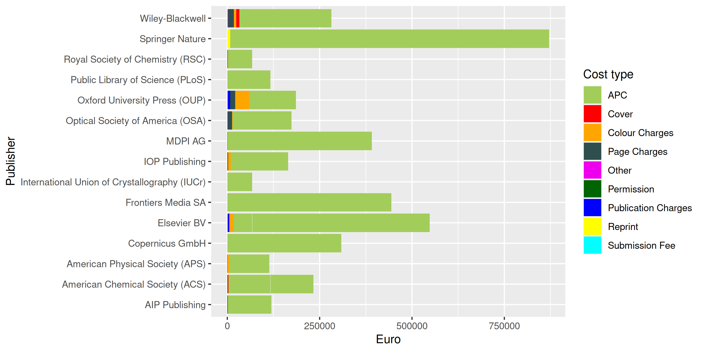
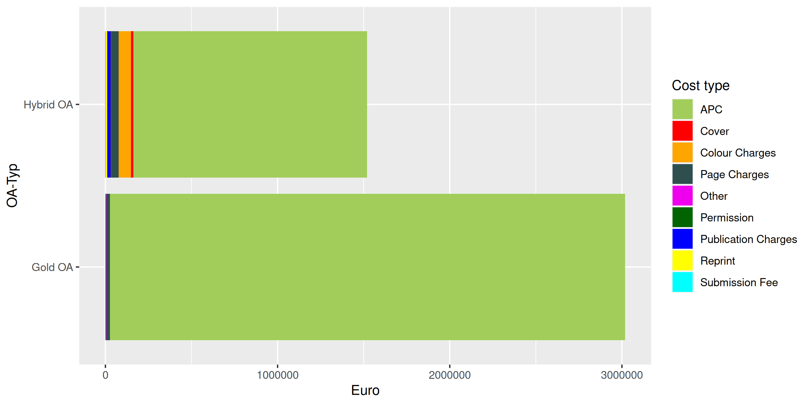
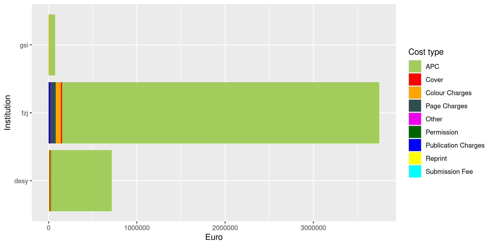

## About

The aim of this repository is:

- to release data sets on fees paid for Open Access journal articles and monographs by Universities and Research Society Funds under an Open Database License
- to demonstrate how reporting on fee-based Open Access publishing can be made more transparent and reproducible across institutions.

At the moment this project provides the following cost data:

| Publication Type | Count           | Aggregated Sum (€)      | Contributing Institutions              |
|------------------|-----------------|-------------------------|----------------------------------------|
| Articles         |161,499 | 310,283,283    | 375 |
| Monographs       |1,412 | 8,922,210    | 25 |

&nbsp;&nbsp;([What's this?](https://github.com/OpenAPC/openapc-de/wiki/Data-Integrity-Testing))

## How to access the data?

There are several options. You may simply download the the raw data sets in CSV format, query our [OLAP server](https://github.com/OpenAPC/openapc-olap/blob/master/HOWTO.md) or use our [Treemap site](https://treemaps.openapc.net/) for visual data exploration.

| Dataset         | CSV File                                                                                                                                                         | OLAP Cube                                                               | Treemap                                                               |
|-----------------|------------------------------------------------------------------------------------------------------------------------------------------------------------------|-------------------------------------------------------------------------|-----------------------------------------------------------------------|
| articles        | [APC file](https://github.com/OpenAPC/openapc-de/blob/master/data/apc_de.csv), [data schema](https://github.com/OpenAPC/openapc-de/wiki/schema#openapc-data-set) | [APC cube](https://olap.openapc.net/cube/openapc/aggregate)             | [APC treemap](https://treemaps.openapc.net/apcdata/openapc/)          |
| monographs      | [BPC file](https://github.com/OpenAPC/openapc-de/blob/master/data/bpc.csv), [data schema](https://github.com/OpenAPC/openapc-de/wiki/schema#bpc-data-set)        | [BPC cube](https://olap.openapc.net/cube/bpc/aggregate)                 | [BPC treemap](https://treemaps.openapc.net/apcdata/bpc/)              |

## How to contribute?

Any academic institution or research funder paying for Article Process Charges (APCs) or Book Processing Charges (BPCs) can contribute to OpenAPC, no formal registration is required.
This [page](https://github.com/OpenAPC/openapc-de/wiki/Data-Submission-Handout) ([German version](https://github.com/OpenAPC/openapc-de/wiki/Handreichung-Dateneingabe)) explains the details.

## Additional costs

OpenAPC also aggregates data on additional costs linked to OA publishing:

|Cost type           | Occurence| Median|     Sum|
|:-------------------|---------:|------:|-------:|
|APC                 |      2320|   1632| 4350527|
|Cover               |         9|   1295|   12704|
|Colour Charges      |        40|   1643|   72757|
|Page Charges        |        63|    831|   63271|
|Other               |       114|     28|    5900|
|Permission          |         9|    189|    1660|
|Publication Charges |        15|   1143|   18958|
|Reprint             |         7|    399|   10450|
|Submission Fee      |        10|     68|     768|

#### Example Data: Additional costs per publisher

#### Example Data: Additional costs per hybrid status

#### Example Data: Additional costs per Institution

## Participating German Universities

So far, the following German universities have agreed to share information on paid author processing charges (APC):

- [Bauhaus-Universität Weimar](https://www.uni-weimar.de/en/university/structure/central-university-facilities/university-library/research/open-access/open-access-publication-fund/)
- [Bayreuth University](http://www.ub.uni-bayreuth.de/en/digitale_bibliothek/open_access/index.html)
- [Bielefeld University](http://oa.uni-bielefeld.de/publikationsfonds.html)
- [Catholic University of Eichstätt-Ingolstadt](https://www.ku.de/bibliothek/forschen-und-publizieren/open-access)
- [Charité - Universitätsmedizin Berlin](https://bibliothek.charite.de/publizieren/open_access)
- [Christian-Albrechts-Universität zu Kiel](https://www.ub.uni-kiel.de/en/open-access-publishing/open-access)
- [Clausthal University of Technology](http://www.ub.tu-clausthal.de/en/angebote-fuer-wissenschaftlerinnen/elektronisches-publizieren/publikationsfonds/)
- [Freie Universität Berlin](http://www.fu-berlin.de/sites/open_access/finanzierung/publikationsfonds/index.html)
- [Friedrich-Alexander-Universität Erlangen-Nürnberg](https://ub.fau.de/schreiben-publizieren/open-access/dfg-gefoerderter-publikationsfonds/)
- [Friedrich-Schiller-Universität Jena](https://www.thulb.uni-jena.de/Kontakt+_+Service/Elektronisches+Publizieren+_+Open+Access.html)
- [Goethe-Universität Frankfurt am Main](https://www.ub.uni-frankfurt.de/publizieren/publikationsfonds.html)
- [Hamburg University of Applied Sciences](https://www.haw-hamburg.de/hibs/publizieren/publikationsfonds/)
- [Hamburg University of Technology](https://www.tub.tu-harburg.de/publizieren/openaccess/)
- [Heidelberg University](http://www.ub.uni-heidelberg.de/Englisch/service/openaccess/publikationsfonds.html)
- [Heinrich-Heine-Universität Düsseldorf](https://www.ulb.hhu.de/en/reseach-teaching-publishing/open-access/hhus-open-access-fund)
- [Hochschule Düsseldorf](https://bib.hs-duesseldorf.de/en)
- [Hochschule Hannover](https://www.hs-hannover.de/ueber-uns/organisation/bibliothek/services/publizieren-an-der-hsh/)
- [Hochschule für Technik und Wirtschaft Dresden](https://www.htw-dresden.de/oa)
- [Humboldt-Universität zu Berlin](https://www.ub.hu-berlin.de/de/forschen-publizieren/open-access/foerdermoeglichkeiten/finanzierung/publikationsfonds?set_language=de)
- [Leibniz Universität Hannover](https://tib.eu/oafonds)
- [Leipzig University](https://www.ub.uni-leipzig.de/open-science/publikationsfonds/)
- [Ludwig-Maximilians-Universität München](http://www.en.ub.uni-muenchen.de/writing/open-access-publishing/funding/index.html)
- [Martin-Luther-Universität Halle-Wittenberg](https://bibliothek.uni-halle.de/dbib/openaccess/)
- [Philipps-Universität Marburg](https://www.uni-marburg.de/de/ub/forschen/open-access/open-access-publikationsfonds)
- [Medizinische Hochschule Brandenburg Theodor Fontane](https://www.mhb-fontane.de/open-access-publikationsfonds-482.html)
- [Münster University](https://www.uni-muenster.de/Publizieren/service/publikationsfonds/)
- [JGU Mainz](https://www.ub.uni-mainz.de/de/open-access/foerderkriterien-open-access)
- [JLU Giessen](https://www.uni-giessen.de/ub/en/digitales-publizieren-en/openaccess-en/oafonds-en?set_language=en)
- [Osnabrück University](https://www.ub.uni-osnabrueck.de/publizieren_archivieren/open_access/publikationsfonds.html)
- [Otto-von-Guericke-Universität Magdeburg](https://www.ub.ovgu.de/en/Publication+_+Open+Access/Open+Access/Publication+Fund+for+Articles.html)
- [Rheinische Friedrich-Wilhelms-Universität Bonn](https://www.open-access.uni-bonn.de/de)
- [Ruhr Universität Bochum](http://www.ruhr-uni-bochum.de/oa/)
- [Saarland University](https://www.sulb.uni-saarland.de/lernen/open-access/open-access-publikationsfonds/)
- [Technische Hochschule Wildau](https://www.th-wildau.de/hochschule/zentrale-einrichtungen/hochschulbibliothek/open-access-und-publikationsdienste/publikationsfonds/)
- [Technische Universität Berlin](http://www.ub.tu-berlin.de/publikationsfonds/)
- [Technische Universität Braunschweig](https://ub.tu-braunschweig.de/publikationsfonds/englisch/index_en.php)
- [Technische Universität Chemnitz](https://www.tu-chemnitz.de/ub/publizieren/openaccess/index.html.en)
- [Technische Universität Darmstadt](https://www.ulb.tu-darmstadt.de/service/elektronisches_publizieren/oa_publikationsfond/index.en.jsp)
- [Technische Universität Dortmund](https://www.ub.tu-dortmund.de/open-access/index.html.en)
- [Technische Universität Dresden](https://www.slub-dresden.de/veroeffentlichen/open-access-finanzieren)
- [Technische Universität Ilmenau](https://www.tu-ilmenau.de/universitaet/quicklinks/universitaetsbibliothek/forschen-publizieren/open-access/open-access-finanzierung/open-access-publikationsfonds)
- [Technische Universität München](https://www.ub.tum.de/en/publishing-fund)
- [University of Applied Sciences Bielefeld](https://www.fh-bielefeld.de/open-access/publikationsfonds)
- [University of Bamberg](http://www.uni-bamberg.de/en/ub/publishing/open-access-publishing/open-access-funds/)
- [University of Bremen](http://www.suub.uni-bremen.de/home-english/refworks-and-publishing/open-access-in-bremen-2/)
- [University of Duisburg-Essen](https://www.uni-due.de/ub/publikationsdienste/oa_foerderung.php)
- [University of Erfurt](https://www.uni-erfurt.de/bibliothek/forschen-und-publizieren/publizieren/open-access)
- [University of Freiburg](https://www.ub.uni-freiburg.de/en/support/electronic-publishing/open-access/open-access-publication-fund/)
- [University of Göttingen](http://www.sub.uni-goettingen.de/en/electronic-publishing/open-access/open-access-publication-funding/)
- [University of Greifswald](https://ub.uni-greifswald.de/en/service/for-academics/open-access/finanzierung-von-publikationen/publication-fund/)
- [University of Kassel](http://www.uni-kassel.de/go/publikationsfonds)
- [University of Konstanz](https://www.kim.uni-konstanz.de/en/openscience/publishing-and-open-access/funding-open-access/)
- [University of Mannheim](https://www.bib.uni-mannheim.de/en/open-access-publishing-fund/)
- [University of Oldenburg](https://uol.de/en/bis/research-publishing/open-access/open-access-publication-fund)
- [University of Passau](https://www.ub.uni-passau.de/publizieren/open-access/publikationsfonds/)
- [University of Potsdam](https://publishup.uni-potsdam.de/home/index/help/content/publication_fund)
- [University of Regensburg](http://oa.uni-regensburg.de/)
- [University of Rostock](https://www.ub.uni-rostock.de/en/wissenschaftliche-services/open-access/open-access-foerdermoeglichkeiten/open-access-publikationsfonds-der-universitaet-rostock/)
- [University of Siegen](https://www.ub.uni-siegen.de/index.php?id=1510&L=1)
- [University of Stuttgart](https://oa.uni-stuttgart.de/publizieren/fonds/)
- [University of Trier](https://www.uni-trier.de/index.php?id=60802)
- [University of Tübingen](https://uni-tuebingen.de/en/facilities/university-library/publishing-research/publishing/open-access-publication-fund/)
- [University of Veterinary Medicine Hannover, Foundation (TiHo)](http://www.tiho-hannover.de/de/kliniken-institute/bibliothek/open-access/publikationsfonds-an-der-tiho/)
- [University of Würzburg](https://www.bibliothek.uni-wuerzburg.de/en/research-publishing/open-access/publication-fund/)
- [Ulm University](https://www.uni-ulm.de/en/einrichtungen/kiz/service-katalog/wid/publikationsmanagement/open-access/open-access/)

## Participating German Research Organisations

### Fraunhofer Society

- [Fraunhofer Publishing Fund](https://www.openaccess.fraunhofer.de/en/open-access-strategy.html)

### Helmholtz Association

- [DLR - Deutsches Zentrum für Luft- und Raumfahrt](https://www.dlr.de/zb/en/desktopdefault.aspx/tabid-8234/)
- [Forschungszentrum Jülich](https://www.fz-juelich.de/zb/DE/Leistungen/Open_Access/publikationsfonds/publikationsfonds_node.html)
- [GEOMAR - Helmholtz Centre for Ocean Research Kiel](https://www.geomar.de/en/centre/central-facilities/bibliothek/author-services/publication-costs)
- [Helmholtz-Zentrum Dresden-Rossendorf](http://www.hzdr.de/db/Cms?pNid=73)
- [Helmholtz-Zentrum für Umweltforschung - UFZ](https://www.ufz.de/index.php?en=36297)
- [GFZ German Research Centre for Geosciences](https://www.gfz-potsdam.de/en/home/) (data provided by the [Library Wissenschaftspark Albert Einstein](http://bib.telegrafenberg.de/en/publishing/open-access/))
- [KIT Karlsruhe](http://www.bibliothek.kit.edu/cms/kit-publikationsfonds.php)
- [Max Delbrück Center for Molecular Medicine (MDC)](https://www.mdc-berlin.de/about_the_mdc/structure/administration/library/oa?mdcbl%5B0%5D=/library&mdctl=0&mdcou=0&mdcot=0&mdcbv=nqe3t2xG8PGtPtxTs7kNhLVIaYkEwltgLl3DWBohxeI)

### Leibniz Association

- [DIPF | Leibniz Institute for Research and Information in Education](https://www.dipf.de/en/knowledge-resources/dipfdocs-open-access?set_language=en)
- [GIGA German Institute of Global and Area Studies](https://www.giga-hamburg.de/en/giga-open-access-guidelines)
- [IFW - Leibniz-Institut für Festkörper- und Werkstoffforschung Dresden](https://www.ifw-dresden.de/about-us/library)
- [IGB - Leibniz-Institute of Freshwater Ecology and Inland Fisheries](https://www.igb-berlin.de/en/library)
- [INM - Leibniz Institute for New Materials](https://www.ntnm-bib.de/open-access/publikationsfonds/)
- [IPN - Leibniz Institute for Science and Mathematics Education](http://www.ipn.uni-kiel.de/en/the-ipn/library/open-access)
- [Leibniz Association's Open Access Publishing Fund](https://www.leibniz-gemeinschaft.de/en/research/open-science-and-digitalisation/open-access)
- [Paul-Drude-Institut für Festkörperelektronik](http://www.pdi-berlin.de/home/) 
- [Potsdam Institute for Climate Impact Research](https://www.pik-potsdam.de) (data provided by the [Library Wissenschaftspark Albert Einstein](http://bib.telegrafenberg.de/en/publishing/open-access/))
- [Technische Informationsbibliothek (TIB) - German National Library of Science and Technology](https://www.tib.eu/en/service/tib-open-access-policy/)
- [WIAS - Weierstrass Institute for Applied Analysis and Stochastics](https://www.wias-berlin.de/services/library/)

### Max Planck Society

- [Max Planck Digital Library](http://www.mpdl.mpg.de/21-specials/50-open-access-publishing.html)

The data content covers APCs as paid for by the central budget for the Max Planck Society (MPS). APCs funded locally by Max Planck Institutes are not part of the data. The MPS has a limited input tax reduction. The refund of input VAT for APC is 20%. Until the end of 2007 the MPS was VAT exempt.

## Other German Institutions

- [Institut für Arbeitsmarkt- und Berufsforschung (IAB)](https://www.iab.de/de/informationsservice/open-access-im-iab.aspx)
- [Knowledge Unlatched](https://www.knowledgeunlatched.org/)
- [OA-Monofonds Brandenburg](https://open-access-brandenburg.de/fonds/)
- [SWP - German Institute for International and Security Affairs](https://www.swp-berlin.org/en/)

## Participating Austrian Institutions

- [FWF - Austrian Science Fund](https://www.fwf.ac.at/en/research-funding/open-access-policy/)
- [Institute of Science and Technology Austria](https://ist.ac.at/en/research/library/publish-communicate/)
- [Johannes Kepler University Linz](https://www.jku.at/en/library/service/bibliometrics-and-publication-support/open-access-publishing/publication-fund/)
- [University of Salzburg](https://www.plus.ac.at/university-library/services/open-access/open-access-policy/?lang=en)
- [Technische Universität Wien](https://www.tuwien.at/en/library/research-and-publishing/funding)

## Participating Swiss Institutions

- [SNSF - Swiss National Science Foundation](http://www.snf.ch/en/theSNSF/research-policies/open-access/Pages/default.aspx#OA%202020%20Policy)
- [Bern University of Applied Sciences](http://www.bfh.ch/)
- [University of Basel](https://www.unibas.ch/en/University/Administration-Services/Vice-President-for-Research/Grants-Office/Grants-Office-News/Grants-Office-Newsletter-2020-12/Open-Access.html)
- [University of Bern](https://www.ub.unibe.ch/services/open_science/open_access/oa_fonds/index_eng.html)
- [Eawag - Swiss Federal Institute of Aquatic Science and Technology](https://www.eawag.ch/en/) (via [Lib4RI](https://www.lib4ri.ch/services/open-access.html))
- [Empa - Swiss Federal Laboratories for Materials Science and Technology](https://www.empa.ch/) (via [Lib4RI](https://www.lib4ri.ch/services/open-access.html))
- [ETH Zurich](https://library.ethz.ch/en/publishing-and-archiving/publishing-and-registering/publishing-in-open-access-journals.html)
- [University of Zurich](https://www.ub.uzh.ch/de/wissenschaftlich-arbeiten/publizieren/Open-Access/Open-Access-an-der-UZH.html)
- [Lucerne University of Applied Sciences and Arts](https://www.hslu.ch/de-ch/hochschule-luzern/campus/bibliotheken/open-access-zugang-zu-wissenschaftlichen-arbeiten/)
- [Pädagogische Hochschule Zürich](https://phzh.ch/de/Forschung/grundsatze/open-access/)
- [PSI - Paul Scherrer Institute](https://www.psi.ch/en)
- [University of Teacher Education Lucerne](https://www.phlu.ch/)
- [University of Lucerne](https://www.unilu.ch/en/university/services/gs/research-information-system-fis/)
- [WSL - Swiss Federal Institute for Forest, Snow and Landscape Research](https://www.wsl.ch/en/index.html)
- [ZHAW Zurich University of Applied Sciences](https://www.zhaw.ch/en/library/writing-publishing/publishing-and-open-access/oa-at-the-zhaw/#c112481)
- [Zurich University of the Arts ZHdK](https://www.zhdk.ch/miz/miz-oa)

## Participating Italian Institutions

- [Free University of Bozen-Bolzano](https://www.unibz.it/en/services/library/publishing-at-unibz/unibz-open-access-publishing-fund/)
- [Università degli Studi di Milano](http://www.unimi.it/ENG/)
- [Veneto Institute of Oncology IOV IRCCS](https://www.ioveneto.it/ricerca/biblioteca/)

## Institutions from Norway:

- Akershus University Hospital
- BI Norwegian Business School
- Bergen University College
- Fridtjof Nansen Institute
- GenØk - Centre for Biosafety
- Harstad University College
- Innlandet Hospital Trust
- Institute of Marine Research
- Molde University College
- NILU - Norwegian Institute for Air Research
- Nansen Environmental and Remote Sensing Center
- Nord University
- Norwegian Center for Studies on Violence and Traumatic Stress
- Norwegian Institute for Agricultural and Environmental Research
- Norwegian Institute for Nature Research
- Norwegian Institute of Public Health
- Norwegian Institute of Water Research
- Norwegian School of Sport Sciences
- Norwegian University of Life Sciences
- Norwegian University of Science and Technology
- Oslo University Hospital
- Oslo and Akershus university college
- SINTEF (Foundation for Scientific and Industrial Research)
- Sørlandet Hospital Trust
- Uni Research
- University College of Southeast Norway
- University of Agder
- University of Bergen
- University of Oslo
- University of Stavanger
- University of Tromsø - The Arctic University of Norway
- Vestfold Hospital Trust
- Vestre Viken Hospital Trust

## Participating Spanish Institutions:

- [Universitat de Barcelona](http://crai.ub.edu/en/crai-services/open-access-ub)

## Institutions from Sweden (via [Open APC Sweden](https://github.com/Kungbib/openapc-se)):

- BTH Blekinge Institute of Technology
- Chalmers University of Technology
- Dalarna University
- Halmstad University
- Swedish School of Sport and Health Sciences
- University of Gothenburg
- University of Borås
- University of Skövde
- University West
- Karlstad University
- Karolinska Institutet
- KTH Royal Institute of Technology
- Linköping University
- Linnaeus University
- Luleå University of Technology
- Lund University
- Malmö University
- Mälardalen University
- Örebro University
- Swedish University of Agricultural Sciences
- Södertörns University
- Stockholm School of Economics
- Stockholm University
- Umeå University
- Uppsala University

## Institutions from Finland (Some of them reported by the [CSC](https://www.csc.fi/en/-/virta-publication-information-service)):

- Aalto University
- Haaga-Helia University of Applied Sciences
- Häme University of Applied Sciences
- [Hanken School of Economics](https://www.hanken.fi/en)
- JAMK University of Applied Sciences
- Lapin ammattikorkeakoulu (Lapland University of Applied Sciences)
- [Laurea University of Applied Sciences](https://www.laurea.fi/en/)
- Natural Resources Institute Finland
- Satakunta University of Applied Sciences (SAMK)
- Seinäjoki University of Applied Sciences
- South-Eastern Finland University of Applied Sciences (Xamk)
- [Tampere University](https://libguides.tuni.fi/open-access/introduction)
- University of Applied Sciences Savonia
- [University of Eastern Finland](https://www.uef.fi/en/etusivu)
- [University of Helsinki](https://www.helsinki.fi/en)
- [University of Jyväskylä](https://openscience.jyu.fi/en/open-access-publishing)
- [University of Turku](https://utuguides.fi/openaccess)
- [University of Vaasa](https://www.uwasa.fi/en)
- VTT Technical Research Centre of Finland Ltd

## Institutions from France

The [Couperin consortium](https://couperin.org) aggregates data on APC expenditures made by institutions in France:

- Agence nationale de sécurité du médicament et des produits de santé (ANSM)
- AgroParisTech
- Aix-Marseille Université
- Université d'Angers
- Université de Bordeaux
- Université de Bourgogne
- Université de Bretagne Occidentale
- Université de Bretagne-Sud
- Centre de coopération internationale en recherche agronomique pour le développement (CIRAD)
- Centre national de la recherche scientifique (CNRS)
- CHU de Rennes
- Commissariat à l'énergie atomique et aux énergies alternatives (CEA)
- Conservatoire national des arts et métiers
- Ecole centrale de Lyon
- École nationale du génie de l'eau et de l'environnement de Strasbourg (ENGEES)
- École nationale supérieure d'ingénieurs de Caen (ENSICAEN)
- Ecole normale supérieure de Paris
- École supérieure de physique et de chimie industrielles de la Ville de Paris (ESPCI)
- ENS de Lyon
- ENSTA Bretagne
- European Synchrotron Radiation Facility (ESRF)
- Hospices Civils de Lyon
- Université Grenoble Alpes
- IMT Atlantique
- INSA de Lyon
- INSA Strasbourg
- Institut de recherche pour le développement (IRD)
- Institut français des sciences et technologies des transports, de l'aménagement et des réseaux (IFSTTAR)
- Institut Français de Recherche pour l'Exploitation de la Mer (IFREMER)
- Institut Laue-Langevin
- Institut national de recherche en informatique et en automatique (INRIA)
- Institut national de la recherche agronomique (INRA)
- Institut de radioprotection et de sûreté nucléaire (IRSN)
- Institut national de recherche pour l'agriculture, l'alimentation et l'environnement (INRAE)
- Institut national de recherche en sciences et technologies pour l'environnement et l'agriculture (IRSTEA)
- Institut national de la santé et de la recherche médicale (INSERM)
- Institut national polytechnique de Toulouse (INPT)
- Institut supérieur d'agriculture Rhône-Alpes (ISARA)
- Institut Pasteur
- Laboratoire national d'essais (LNE)
- Le Mans Université
- MINES ParisTech
- Museum National d'Histoire Naturelle
- Office National d'Etudes et de Recherches Aérospatiales (ONERA)
- Paris 8 Vincennes - Saint-Denis
- Sciences Po Paris
- Sorbonne Université
- Avignon Université
- Université de Caen Normandie
- Université Claude Bernard Lyon 1
- Université Clermont Auvergne
- Université de Côte d'Azur
- Université Technologique de Compiègne
- Université Evry Val-d'Essonne
- Université Gustave Eiffel
- Université de Franche-Comté
- Université de Haute-Alsace
- Université du Havre
- Université de La Rochelle
- Université Lille 1
- Université Lille 2
- Université de Lille
- Université de Montpellier
- Université de Lorraine
- Université de Nantes
- Université de Nouvelle Calédonie
- Université de Pau et des Pays de l'Adour
- Université de Perpignan - Via Domitia
- Université de Poitiers
- Université de Reims Champagne Ardenne
- Université de Rennes 1
- Université de La Réunion
- Université de Strasbourg
- Université de Toulon
- Université de Tours
- Université de Versailles-Saint-Quentin-en-Yvelines
- Université des Antilles
- Université du Littoral Côte d'Opale
- Université Toulouse III
- Université de technologie de Troyes
- Université Paris 1 Panthéon-Sorbonne
- Université Paris Descartes (Paris V)
- Université Paris-Est Marne-la-Vallée
- Université Paris Nanterre
- Université Pierre et Marie Curie (Paris VI)
- Université Paris Diderot (Paris VII)
- Université Polytechnique Hauts-de-France
- Université Savoie Mont Blanc

## Participating Institutions from the United Kingdom:

- [Wellcome Trust](https://wellcome.ac.uk/funding/managing-grant/open-access-policy)
- [JISC](https://www.jisc.ac.uk/reports/apcs-and-subscriptions)

Jisc Collections released data on APC payments made by UK higher education institutions (HEIs):

- Aberystwyth University
- Aston University
- Bangor University
- Birkbeck College
- Brunel University
- Cardiff University
- Cranfield University
- Edinburgh Napier University
- Glasgow Caledonian University
- Goldsmiths
- Heriot-Watt University
- Imperial College London
- Institute of Cancer Research (ICR)
- Keele University
- King's College London
- Leeds Beckett University
- Liverpool John Moores University
- Liverpool School of Tropical Medicine
- London School of Economics (LSE)
- London School of Hygiene & Tropical Medicine (LSHTM)
- Lancaster University
- Manchester Metropolitan University
- Northumbria University
- Plymouth University
- Queen Mary, University of London
- Queen's University Belfast
- Royal Holloway
- Royal Veterinary College
- St George's, University of London
- Swansea University
- The Open University
- University College London (UCL)
- University of Aberdeen
- University of Bath
- University of Birmingham
- University of Bristol
- University of Cambridge
- University of Dundee
- University of Durham
- University of East Anglia
- University of Edinburgh
- University of Exeter
- University of Glasgow
- University of Huddersfield
- University of Hull
- University of Kent
- University of Leeds
- University of Leicester
- University of Liverpool
- University of Loughborough
- University of Manchester
- University of Newcastle
- University of Nottingham
- University of Oxford
- University of Portsmouth
- University of Reading
- University of Salford
- University of Sheffield
- University of Southampton
- University of St Andrews
- University of Strathclyde
- University of Surrey
- University of Sussex
- University of the West of England
- University of Ulster
- University of Warwick
- University of York

## Participating Institutions from the Czech Republic:

- [Charles University](https://cuni.cz/UKEN-1.html)
- [University of Chemistry and Technology, Prague](https://www.chemtk.cz/en/)
- [Technical University of Ostrava](https://www.vsb.cz/en)

## Participating Institutions from Hungary

- [University of Debrecen](https://unideb.hu/en)

## Participating Institutions from Serbia

- [University of Belgrade](http://bg.ac.rs/en/)

## Participating Institutions from Belgium

- [University of Liège](https://www.uliege.be/cms/c_8699436/en/uliege)

## Participating Institutions from the United States:

- [Bill & Melinda Gates Foundation](https://www.gatesfoundation.org/how-we-work/general-information/open-access-policy)
- [Harvard University](https://osc.hul.harvard.edu/programs/hope/)
- [Indiana University - Purdue University Indianapolis (IUPUI)](http://www.ulib.iupui.edu/digitalscholarship/openaccess/oafund)
- [University of Rhode Island](https://uri.libguides.com/oafund)
- [Thomas Jefferson University](https://library.jefferson.edu/pub/open_access.cfm)
- [Virginia Polytechnic Institute and State University](http://guides.lib.vt.edu/oa)

## Participating Canadian Institutions:

- [University of Calgary](https://library.ucalgary.ca/oa/)

## Participating Institutions from Qatar:

- [Qatar National Library](https://www.qnl.qa/en) 

## Participating Institutions from Malawi:

- Malawi-Liverpool-Wellcome Clinical Research-Programme

## Participating Institutions from Thailand:

- Mahidol Oxford Tropical Medicine Research Unit

## Participating Institutions from Vietnam:

- Oxford University Clinical Research Unit

## Supranational participants

- [OpenAIRE](https://www.openaire.eu/fp7-oapilot) (FP7 Post-Grant Open Access Pilot)

## Data sets

*Note: The following numbers and plots are always based on the [latest revision](https://github.com/OpenAPC/openapc-de/releases/latest) of the OpenAPC data set. The underlying code can be found in the associated [R Markdown template](README.Rmd).*

### Articles (APCs)

The article data set contains information on 161,499 open access journal articles being published in fully and hybrid open access journal. Publication fees for these articles were supported financially by 375 research performing institutions and research funders. 

In total, article publication fee spending covered by the OpenAPC initiative amounted to € 310,283,283. The average payment was € 1,921 and the median was € 1,759.

108,059 articles in the data set were published in fully open access journals. Total spending on publication fees for these articles amounts to € 177,060,035, including value-added tax; the average payment was € 1,639 (median =  € 1,570, SD = € 769).

Hybrid open access journals rely on both publication fees and subscriptions as revenue source. 53,440 articles in the data set were published in hybrid journals. Total expenditure amounts to 133,223,248 €; the average fee was € 2,493 (median =  € 2,454, SD = € 1,003).

#### Spending distribution over fully and hybrid open access journals

#### Spending distribution details

|period | OA articles| OA mean| OA median|    OA min - max| Hybrid Articles| Hybrid mean| Hybrid median| Hybrid min - max|
|:------|-----------:|-------:|---------:|---------------:|---------------:|-----------:|-------------:|----------------:|
|2005   |           7|     858|       871| 480.00 -  1,350|               1|       2,983|         2,983| 2,983.3 -  2,983|
|2006   |          52|   1,021|     1,095| 665.00 -  1,340|              NA|          NA|            NA|               NA|
|2007   |          88|   1,081|     1,062| 870.00 -  1,825|              NA|          NA|            NA|               NA|
|2008   |         205|   1,170|     1,025| 440.80 -  2,830|               1|       2,660|         2,660| 2,660.0 -  2,660|
|2009   |         359|   1,185|     1,060| 124.63 -  4,386|              NA|          NA|            NA|               NA|
|2010   |         401|   1,261|     1,139| 158.79 -  7,419|               3|       2,318|         2,173| 2,152.0 -  2,630|
|2011   |         777|   1,158|     1,127| 104.85 -  4,666|               6|       1,781|         2,085|   552.0 -  2,631|
|2012   |       1,578|   1,174|     1,175|  69.00 -  4,498|              21|       2,263|         2,376|   997.4 -  2,700|
|2013   |       2,477|   1,229|     1,178|  50.00 -  4,574|           1,099|       2,258|         2,260|   120.2 -  4,679|
|2014   |       5,191|   1,374|     1,255|  40.00 -  9,028|           6,530|       2,237|         2,200|   132.3 -  6,000|
|2015   |       8,461|   1,520|     1,447|  59.00 -  5,669|           6,717|       2,608|         2,620|   126.6 -  8,636|
|2016   |       9,836|   1,635|     1,531|  40.00 -  5,985|           7,901|       2,549|         2,512|     2.3 -  9,079|
|2017   |      14,635|   1,712|     1,554|   8.71 - 14,634|          10,613|       2,530|         2,471|    36.9 -  9,858|
|2018   |      15,128|   1,698|     1,585|  13.00 - 17,778|           9,273|       2,559|         2,543|    17.7 - 13,975|
|2019   |      16,423|   1,683|     1,623|  10.72 -  7,684|           6,319|       2,502|         2,439|    75.3 -  9,500|
|2020   |      18,544|   1,684|     1,677|   0.01 -  8,906|           3,142|       2,368|         2,383|   130.0 -  7,416|
|2021   |      13,740|   1,742|     1,738|  27.03 -  6,417|           1,772|       2,525|         2,479|    30.2 -  9,590|
|2022   |         157|   1,964|     1,931| 421.26 -  4,689|              42|       2,503|         2,591|   285.5 -  3,578|

### Books (BPCs)

The book data set contains information on 1,412 open access books. Publication fees were supported financially by 25 research performing institutions and funders. 

In total, book processing charges covered by the OpenAPC initiative amounted to € 8,922,210. The average payment was € 6,319 and the median was € 6,787.

Books can be made Open Access right from the beginning ("frontlist") or only retroactively after having been published traditionally in the first place ("backlist"), which can have a big influence on the paid BPCs.

#### Spending distribution over frontlist and backlist OA books

#### Spending distribution details

|period | Frontlist books| mean BPC| median BPC|  BPC min - max| Backlist books| mean BPC| median BPC| BPC min - max|
|:------|---------------:|--------:|----------:|--------------:|--------------:|--------:|----------:|-------------:|
|2014   |              61|   15,263|     16,000| 7,714 - 20,000|             NA|       NA|         NA|            NA|
|2015   |              44|   14,676|     14,000| 8,000 - 20,000|             NA|       NA|         NA|            NA|
|2016   |              41|   12,668|     14,000| 1,190 - 22,000|             NA|       NA|         NA|            NA|
|2017   |             184|    9,250|      8,780| 1,075 - 21,000|            195|    1,981|      1,981| 1,981 - 1,981|
|2018   |             144|    9,075|      8,250|   476 - 21,104|            191|    1,875|      1,875| 1,875 - 1,875|
|2019   |             163|    7,995|      8,250|   774 - 22,000|            194|    1,876|      1,875| 1,875 - 1,981|
|2020   |             141|    7,805|      7,500|   190 - 19,200|              1|    1,875|      1,875| 1,875 - 1,875|
|2021   |              46|    5,800|      6,000| 1,190 - 16,120|             NA|       NA|         NA|            NA|

## Use of external sources

Metadata representing publication titles or publisher names is obtained from Crossref in order to avoid extensive validation of records. Cases where we don't re-use information from Crossref to disambiguate the spending metadata are documented [here](python/test/test_apc_csv.py). Moreover, indexing coverage in Europe PMC and the Web of science is automatically checked.

### Articles 

|Source     |Variable  |Description                     |
|:--------------|:---------|:-----------------------------------------------|
|CrossRef   |`publisher` |Title of Publisher             |
|CrossRef   |`journal_full_title` |Full title of the journal  |
|CrossRef   |`issn` |International Standard Serial Numbers (collapsed) |
|CrossRef   |`issn_print` |ISSN print |
|CrossRef   |`issn_electronic`  |ISSN electronic        |
|CrossRef   |`license_ref`  |License of the article     |
|CrossRef   |`indexed_in_crossref`  |Is the article metadata registered with CrossRef? (logical)    |
|EuropePMC    |`pmid`  |PubMed ID                 |
|EuropePMC    |`pmcid` |PubMed Central ID         |
|Web of Science |`ut` |Web of Science record ID             |
|DOAJ           |`doaj` |Is the journal indexed in the DOAJ? (logical)    |

### Books

|Source     |Variable  |Description                     |
|:--------------|:---------|:-----------------------------------------------|
|CrossRef   |`publisher` |Title of Publisher             |
|CrossRef   |`book_title` |Full Title of a Book  |
|CrossRef   |`isbn` |International Standard Book Number |
|CrossRef   |`isbn_print` |ISBN print |
|CrossRef   |`isbn_electronic`  |ISBN electronic        |
|CrossRef   |`license_ref`  |License of the article     |
|CrossRef   |`indexed_in_crossref`  |Is the article metadata registered with CrossRef? (logical)    |
|DOAB           |`doab` |Is the book indexed in the DOAB? (logical)    |

Indexing coverage

|Identifier                 | Coverage                                                          |
|:--------------------------|:------------------------------------------------------------------|
|DOI                        |  99.7%       |
|PubMed ID                  |  73.92%      |
|PubMed Central ID          |  67.8%     |
|Web of Science record ID   | 91.11%      |

## License

The data sets are made available under the Open Database License: http://opendatacommons.org/licenses/odbl/1.0/. Any rights in individual contents of the database are licensed under the Database Contents License: http://opendatacommons.org/licenses/dbcl/1.0/

This work is licensed under the Creative Commons Attribution 4.0 Unported License.

## How to cite?

When citing this data set, please indicate the [release](https://github.com/OpenAPC/openapc-de/releases/) you are referring to. The releases also contain information on contributors relating to the respective release.

Please do not cite the master branch of the Github repository (https://github.com/OpenAPC/openapc-de/tree/master/), but use the release numbers/tags.

Bielefeld University Library archives a copy (including commit history). To cite:

{Contributors:} *Datasets on fee-based Open Access publishing across German Institutions*. Bielefeld University. [10.4119/UNIBI/UB.2014.18](http://dx.doi.org/10.4119/UNIBI/UB.2014.18)

## Acknowledgement

This project was set up in collaboration with the [DINI working group Electronic Publishing](http://dini.de/ag/e-pub1/). It follows [Wellcome Trust example to share data on paid APCs](http://blog.wellcome.ac.uk/2014/03/28/the-cost-of-open-access-publishing-a-progress-report/) and recognises efforts from [JISC](https://www.jisc-collections.ac.uk/News/Releasing-open-data-about-Total-Cost-of-Ownership/) and the [ESAC initative](http://esac-initiative.org/) to standardise APC reporting.

## Contributors

Jens Harald Aasheim, Sarah Abusaada, Benjamin Ahlborn, Chelsea Ambler, Magdalena Andrae, Jochen Apel, Myriam Bastin, Hans-Georg Becker, Roland Bertelmann, Daniel Beucke, Manuela Bielow, Peter Blume, Ute Blumtritt, Sabine Boccalini, Stefanie Bollin, Katrin Bosselmann, Valentina Bozzato, Kim Braun, Christoph Broschinski, Paolo Buoso, Cliff Buschhart, Dorothea Busjahn, Pablo de Castro, Ann-Kathrin Christann, Roberto Cozatl, Amanda Cullin, Patrick Danowski, Gernot Deinzer, Julia Dickel, Andrea Dorner, Stefan Drößler, Karin Eckert, Carsten Elsner, Clemens Engelhardt, Olli Eskola, Katrin Falkenstein-Feldhoff, Ashley Farley, Inken Feldsien-Sudhaus, Silke Frank, Fabian Franke, Claudia Frick, Marléne Friedrich, Paola Galimberti, Agnes Geißelmann, Kai Karin Geschuhn, Marianna Gnoato, Steffi Grimm, Birgit Hablizel, Florian Hagen, Christina Hemme, Ulrich Herb, Elfi Hesse, Dana Horch, Larissa Gordon, Ute Grimmel-Holzwarth, Evgenia Grishina, Christian Gutknecht, Uli Hahn, Kristina Hanig, Margit L. Hartung, Dominik Hell, Eike Hentschel, Ulrich Herb, Stephanie Herzog, Kathrin Höhner, Christie Hurrell, Arto Ikonen, Doris Jaeger, Najko Jahn, Alexandra Jobmann, Daniela Jost, Juho Jussila, Nadja Kalinna, Mirjam Kant, Andreas Kennecke, Robert Kiley, Ilka Kleinod, Lydia Koglin, Nives Korrodi, Biljana Kosanovic, Stephanie Kroiß, Gerrit Kuehle, Stefanie Kutz, Marjo Kuusela, Anna Laakkonen, Ignasi Labastida i Juan, Gerald Langhanke, Inga Larres, Stuart Lawson, Anne Lehto, Sari Leppänen, Camilla Lindelöw, Maria Löffler, Jutta Lotz, Kathrin Lucht-Roussel, Susanne Luger, Jan Lüth, Frank Lützenkirchen, Steffen Malo, Anna Marini, Manuel Moch, Andrea Moritz, Max Mosterd, Marcel Nieme, Anja Oberländer, Jere Odell, Linda Ohrtmann, Vitali Peil, Gabriele Pendorf, Mikko Pennanen, Dirk Pieper, Tobias Pohlmann, Thomas Porquet, Markus Putnings, Andrée Rathemacher, Rainer Rees-Mertins, Edith Reschke, Katharina Rieck, Friedrich Riedel, Simone Rosenkranz, Florian Ruckelshausen, Steffen Rudolph, Ilka Rudolf, Pavla Rygelová, Lea Satzinger, Annette Scheiner, Isabo Schick, Michael Schlachter, Birgit Schlegel, Andreas Schmid, Barbara Schmidt, Katharina Schulz, Stefanie Seeh, Barbara Senkbeil-Stoffels, Adriana Sikora, Tereza Simandlová, Stefanie Söhnitz, Jana Sonnenstuhl, Lisa Spindler, Susanne Stemmler, Matti Stöhr, Eva Stopková, Marius Stricker, Kálmán Szőke, Linda Thomas, Anne Timm, Laura Tobler, Johanna Tönsing, Marco Tullney,  Milan Vasiljevic, Astrid Vieler, Lena Vinnemann, Viola Voß, Christin Wacke, Roland Wagner, Agnieszka Wenninger, Kerstin Werth, Martin Wimmer, Marco Winkler, Sabine Witt, Michael Wohlgemuth, Verena Wohlleben, Qingbo Xu, Philip Young, Esther Zaugg, Philipp Zumstein

## Contact

For bugs, feature requests and other issues, please submit an issue via [Github](https://github.com/OpenAPC/openapc-de/issues/new).

For general comments, email openapc at uni-bielefeld.de

## Disclaimer

People, who are looking for "Open Advanced Process Control Software" for automation, visualization and process control tasks from home control up to industrial automation, please follow <http://www.openapc.com> (2015-09-30)
